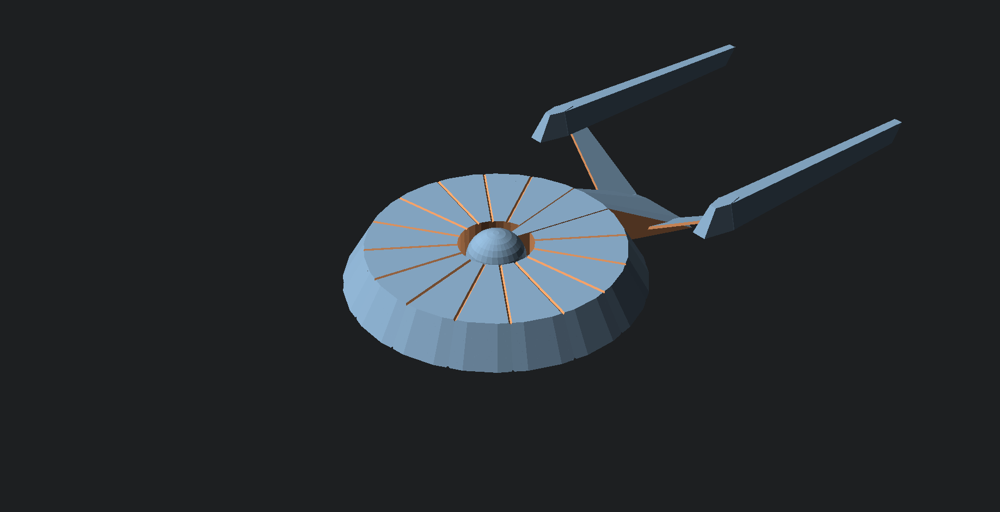
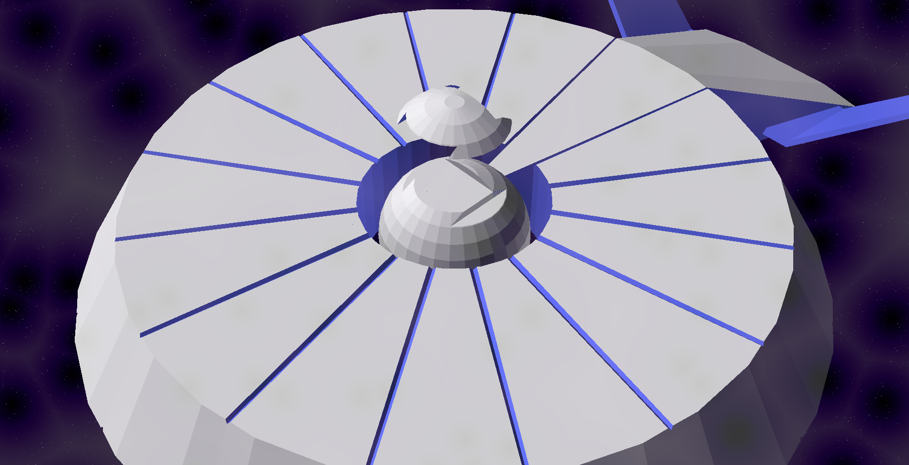
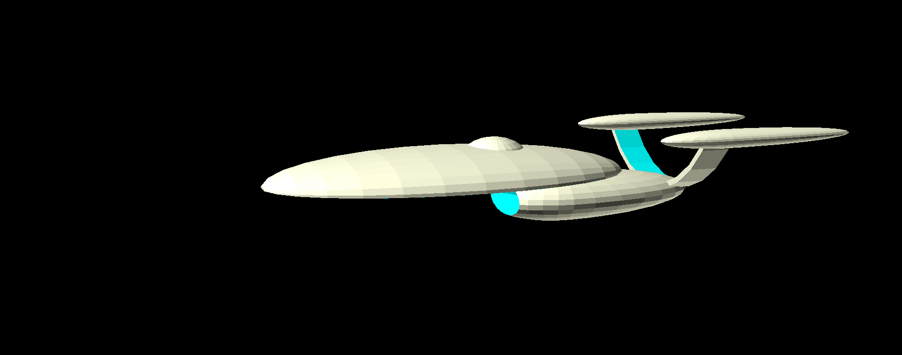
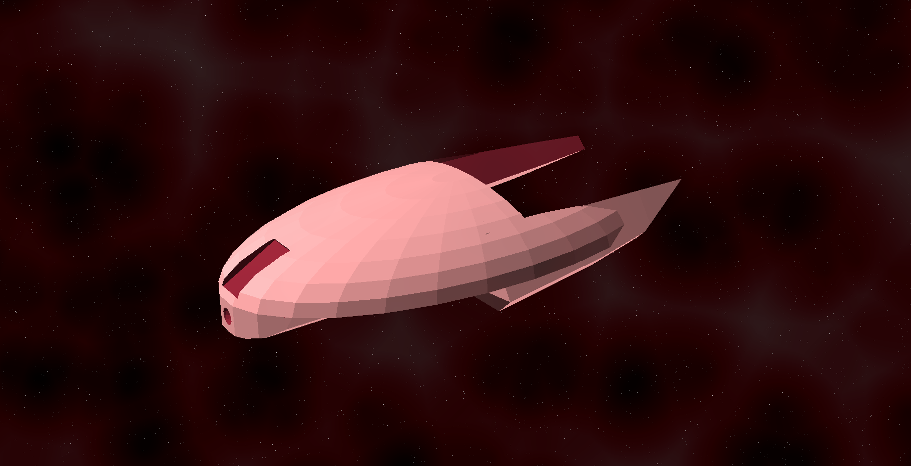
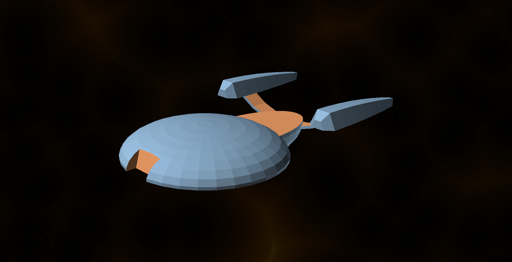
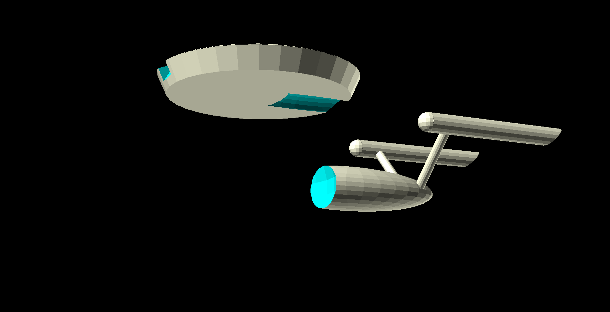
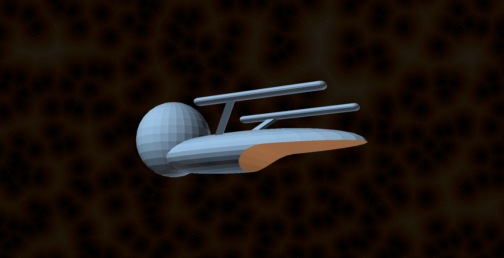
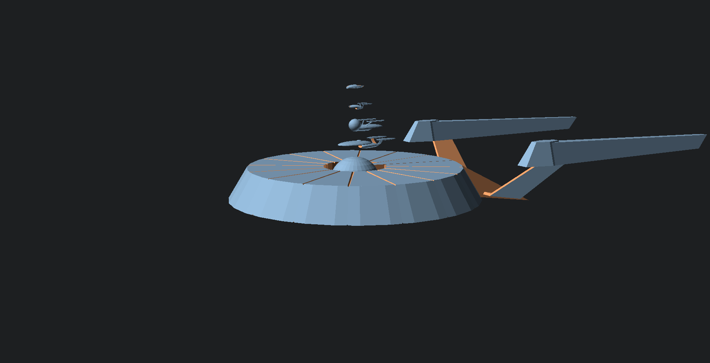
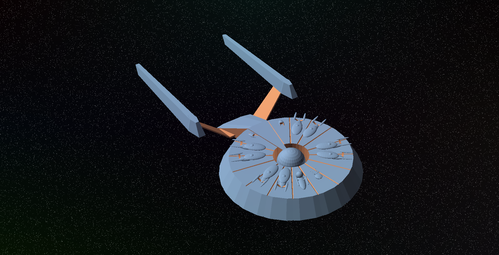

# OpenSCAD designs

Star Trek type starships

## Aviary Class

[View 3d](https://github.com/prasannax1/openscad/blob/master/stl/mother.stl)

Aviary Class Deep Space Explorer/Heavy Cruiser/Carrier

### Stats

 * Length: 1642m
 * Width: 796m
 * Height: 235m
 * Decks: 36
   * Saucer Section: 20 decks (8 decks + 12 decks hangar)
   * Sphere Section: 30 decks
   * Engine Section: 22 decks
   * Warp Pylons: 24 decks (maintenance only)
   * Warp Nacelles: 6 decks (maintenance only)
 * Auxillary Craft - Large:
   * 8 *Magpie Class* Light Science/Scout vessels
   * 24 *Vulture Class* Light Escort/Tactical Scout vessels
   * 1 *Dove Class* Diplomatic Heavy Yacht/Courier
   * 1 *Nightingale Class* Hospital Ship
 * Warp speed:
   * Cruising: Warp 4
   * Maximum: Warp 5
   * Transwarp: ??

### Description

At more than a kilometer and a half long, the *Aviary Class* is an incredible 
behemoth. Equipped with transwarp engines, The *Aviary* is meant to 
transport daughter ships to another quadrant - or even beyond the Galaxy
and act as a starship, starbase and fleet HQ all in one.

The 800m wide saucer section is bigger than the biggest ships so far by
itself, and is split into 16 sectors, each sector containing a massive
hangar in the lower section and livable area in the upper section. All in 
all it's big enough to be a city by itself.

The *Aviary Class* cruises at a sedate warp 4, and can move at warp 5 
when the engine is at maximum warp; which it never will be since the 
primary mode of propulsion for this juggernaut is transwarp.

The *Aviary Class* is built to work without access to a starbase for up to 
twenty years - in fact, with industrial replicators on board this ship 
serves as starbase to itself and the ships contained in it.

The *Aviary Class* isn't going to win any beauty contest - nor for that
matter any races at warp - but it does a job no other ship can do.

### Saucer Separation

Because of the highly unique nature of the *Aviary* the designers had to rethink the
concept of saucer separation completely. When deciding if saucer separation was
needed at all, the design committee looked into when the separation was actually needed in
practice

#### When the ship needs to be in two places at once

This was trivially rejected since with all the auxillary ships, the *Aviary* could be in as
many as 38 different places if needed.

#### To evacuate the civilians in case of threat

Here the committe looked at conventional saucer separations and found a bunch of things 
backwards

 * The part which needs to run away from danger, is not the part which has warp.
 * The crew which needs to command the part which fights the threat, are placed smack in the middle of the part which runs away. They have to spend precious minutes getting to another part of the ship under times of threat.
 
Considering all that, the committee turned around the convention - the saucer is the part
which separates to fight the threat, and the rest of the ship - the part with warp and transwarp - runs away
with the civilians.

[View 3d](https://github.com/prasannax1/openscad/blob/master/stl/ms_saucer.stl)

The upper four decks of the sphere section contains the command crew, phaser arrays, photon torpedoes and a warp core.
When separated this becomes a sort of super-*Vulture Class* to face any threat while the rest of the *Aviary* retreats to
safety.

### Saucer stats

 * Length: 89m
 * Width: 110m
 * Height: 24m
 * Decks: 4
 * Auxillary Craft:
   * 6 Medium Shuttles
 * Warp Speed:
   * Cruising: Warp 7
   * Maximum: Warp 9.5

## Magpie Class

[View 3d](https://github.com/prasannax1/openscad/blob/master/stl/explorer.stl)

Magpie Class Light Science/Scout

### Stats

 * Length: 195m
 * Width: 66m
 * Height: 31m
 * Decks: 7
   * Saucer Section: 3 decks
   * Engine Section: 4 decks
 * Auxillary Craft:
   * 2 Small Shuttles
   * 1 Work Bee
 * Warp Speed:
   * Cruising: Warp 9
   * Maximum: Warp 9.99

### Description

The *Magpie Class* is the workhorse of the *Aviary* mini-fleet. Fast, agile
and reasonable powerful, this ship is supposed to do the bulk of the exploring
on any mission.

The *Magpie Class* is built for speed and it shows in the smooth ergonomic
design of the starships. It cruises comfortably at warp 9, and can do 9.99 
when you put your foot down.

The *Magpie Class* has comfortable labs and bridge, but no holodecks and
everyone has to double up for the bunk beds - even the captain. The shuttle
bay on this ship is one of the smallest on any starship but it can hold two
small shuttles, and a workbee for any external repair work.

The *Magpie Class* typically rendezvous with the *Aviary* mothership after 
every mission or so, but it follows the *Voyager Protocol* and can work without
access to a starbase for up to three years.

The *Magpie Class* is designed to be everything you would expect in a starship
and to also fit in the hangar of an *Aviary Class*.

## Vulture Class

[View 3d](https://github.com/prasannax1/openscad/blob/master/stl/attack.stl)

Vulture Class Light Escort/Tactical Scout

### Stats

 * Length: 57m
 * Width: 31m
 * Height: 11m
 * Decks: 2.5 (2 + "attic" cargo deck)
 * Auxillary Craft: None
 * Warp Speed:
   * Cruising: Warp 7
   * Maximum: Warp 9.95

### Description

The *Vulture Class* is not just named after a bird of prey - for all practical purposes
it is a Bird of Prey built to Star Fleet specifications.

The *Vulture Class* occupies a unique niche in starship where a runabout or a fighter craft
just doesn't cut it, but a *Defiant Class* or equivalent isn't really readily available.
Typical deployment of these vessels is aboard a starbase, and typical missions involve 
escorting a larger vessel through troubled space. And coming back alone.

The *Vulture Class* might be small compared to most of the ships it will face, but it packs 
a mean punch in it's complement of phasers and torpedoes - and as if that were not enough, 
like the pack bird it's named after, the *Vulture Class* typically operates in teams of 
two or three. The multi vector attack patterns more than make up for any disadvantage 
the *Vulture Class* might have in battle.

Unlike the other ships of the *Aviary*, the *Vulture Class* wasn't designed specifically for it.
The *Vulture* has seen several notable battles, and was added as a tried and tested veteran
to the *Aviary* line-up.

In *Aviary* missions, the *Vulture* will typically be deployed in case a *Magpie* runs into 
trouble it can't run out of. The *Vulture* is the cavalry, using it's top speed of warp 9.95 to
arrive at the right moment to rescue.

## Dove Class

[View 3d](https://github.com/prasannax1/openscad/blob/master/stl/diplomat.stl)

Dove Class Diplomatic Heavy Yacht/Courier

### Stats

 * Length: 73.5m
 * Width: 40m
 * Height: 18.5m
 * Decks: 3
   * Saucer Section: 2 decks
   * Engine Section: 2 decks
 * Auxillary Craft: None
 * Warp Speed:
   * Cruising: Warp 7.5
   * Maximum: Warp 9.1

### Description

Other ships have Captain's Yachts for special diplomatic missions. The *Aviary*, with hangars to spare, didn't see
the need to hide a ship in the body contours of the ship.

The *Dove* takes diplomatic crafts to a whole new level. It is designed to resemble the *Constitution Class* of the 23rd century, which still holds the record for maximum first contacts by any class of ships. It was the first
sight of starfleet and the federation for several species in the Alpha Quadrant, and the *Dove Class* hopes to be the
same to new civilizations wherever the *Aviary* is deployed.

Cruising at a respectable warp 7.5, and capable of maxing it out to warp 9.1, the *Dove* is fast despite not really
being built for speed. The *Dove* was defintely designed for luxury, and unlike the *Aviary* itself, it *was* designed
to win beauty contests - and the *Dove* does a great job of giving a first impression.

### Saucer Separation

The *Dove* is the only auxillary vessel on the *Aviary* which has a saucer separation feature. Since the *Dove* doesn't have any auxillary vehicles of itself, the impulse capable saucer section separates and can land on a planet - or a hangar of another ship. And the engineering section remains behind, in case a bailout is needed.

[View 3d](https://github.com/prasannax1/openscad/blob/master/stl/dip_separate.stl)

### Saucer Stats

 * Length: 40m
 * Width: 40m
 * height: 8m
 * Decks: 2
 * Auxillary Craft: None
 * Warp Speed: None

## Nightingale Class

[View 3d](https://github.com/prasannax1/openscad/blob/master/stl/hospital.stl)

Nightingale Class Hospital Ship

### Stats

 * Length: 122m
 * Width: 58m
 * Height: 40m
 * Decks: 10
   * Sphere section: 10 decks
   * Engineering section: 5 decks
 * Auxillary Craft:
   * 2 Medical Runabouts
   * 2 Medium Shuttles
 * Warp Speed:
   * Cruising: Warp 7
   * Maximum: Warp 9
   
### Description

On the *Aviary* an entire sector is dedicated to sickbays, hospitals and clinics for the health and wellness of the crew
within. But quite often, Starfleet is asked to extend a hand of help to other species who do not have the medical facilities to deal with it.

Enter the *Nightingale*. Named after Florence Nightingale, it is as big as a general
hospital itself, it is equipped with some highly specialized medical equipment.
  * Medical transporters with highly sensitive biofilters
  * 4 separate bio-shielded quarantine areas
  * The latest of scanners
  * Gallons of biomemetic gel
  * 20 EMH and 45 EMAH (emergency medical assistant hologram)
  * 1 ECH in case the captain of the ship (nominally, the CMO of the *Aviary*) is incapacitated on mission.
  * Mobile holo-emitter kits to send EMH on missions where humanoids cannot go on.

The *Nightingale* has a cruising speed of warp 7, and can speed up to a warp 9 to get to a medical emergency. It has two medical
runabouts, each of which can be used to evacuate 62 upright passengers or 24 patients in beds in a hurry. It also has two 
shuttles equipped with bio-suits, isolation areas to investigate highly contaminated areas.

The *Nightingale* was supposed to the original explorer model to be associated
with the *Aviary* class before the *Magpie* class was fast tracked into
release. Several might have heaved silent sighs of relief at not having to
face strange new civilizations at the helm of the *Nightingale*, but for the
medical crew the *Nightingale* is irreplaceable.

The *Vulture* bails out starfleet personnel when trouble is imminent; but when trouble has already stuck, it is the *Nightingale*
which delivers mercy and salvation.

## Relative scale of ships

[View 3d](https://github.com/prasannax1/openscad/blob/master/stl/scale.stl)

[View 3d](https://github.com/prasannax1/openscad/blob/master/stl/combined.stl)