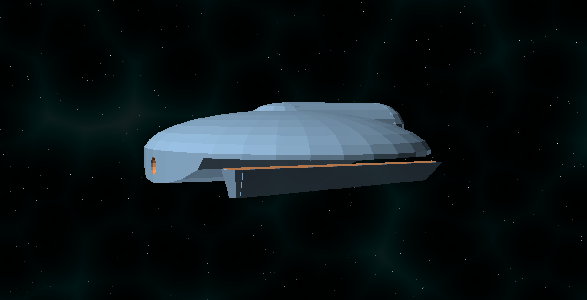
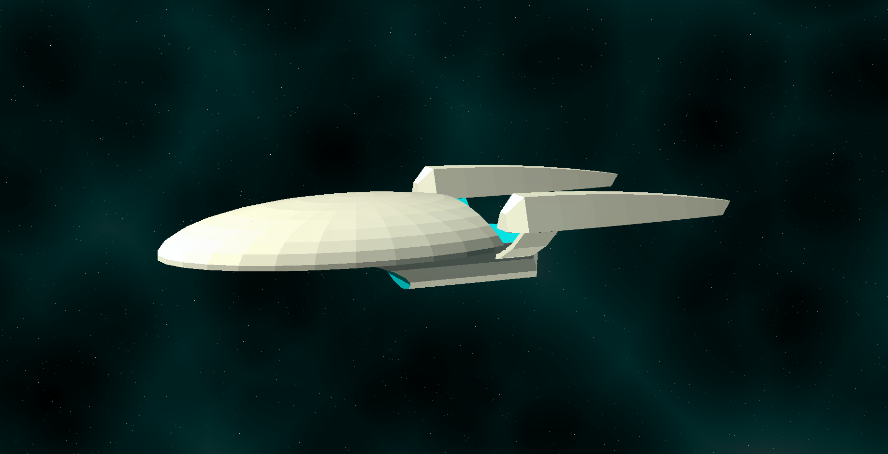

# Starship Designs

Star Trek type starships

## Aviary Class

[View 3d](https://github.com/prasannax1/openscad/blob/master/stl/mother.stl)

Aviary Class Deep Space Explorer/Heavy Cruiser/Carrier

### Stats

 * Length: 1154m
 * Width: 580m
 * Height: 239m
 * Decks: 40
   * Saucer Section: 20 decks
   * Engine Section: 20 decks
 * Auxillary Craft - Large:
   * 14 *Magpie Class* Light Science vessels
   * 12 *Vulture Class* Light Corvette/Patrol vessels
   * 2 *White Owl Class* Light Scout vessels
   * 1 *Dove Class* Diplomatic Yacht/Light Courier
   * 1 *Nightingale Class* Light Hospital Ship
   * 1 Escort Vessel
 * Warp speed:
   * Cruising: Warp 5
   * Maximum: Warp 8
   * Transwarp: ??

### Description

At more than a kilometer long, the *Aviary Class* is an incredible 
behemoth. Equipped with transwarp engines, The *Aviary* is meant to 
transport daughter ships to another quadrant - or even beyond the Galaxy
and act as a starship, starbase and fleet HQ all in one.

The saucer section is almost as big as a *Galaxy Class* by
itself, and is split into 16 sectors, each sector containing a massive
hangar in the lower section and livable area in the upper section. All in 
all it's big enough to be a city by itself.

The *Aviary Class* cruises at a sedate warp 5, and can move at warp 8 
when the engine is at maximum warp; which it never will be since the 
primary mode of propulsion for this juggernaut is transwarp.

The *Aviary Class* is built to work without access to a starbase for up to 
twenty years - in fact, with industrial replicators on board this ship 
serves as starbase to itself and the ships contained in it.

### Captain's Yacht

In the space under the saucer traditionally used by Captain's yachts, the 
*Aviary* has a dedicated Escort vessel. Nicknamed the *Bat Class* (because
it hangs upside down), is about as big as a *Defiant Class* and is as
powerful as the *Defiant* would be if it was made today.

[View 3d](https://github.com/prasannax1/openscad/blob/master/stl/ms_saucer.stl)

### "*Bat Class*" stats

 * Length: 249m
 * Width: 155m
 * Height: 24m
 * Decks: 4
 * Auxillary Craft:
   * 2 Medium Shuttles
 * Warp Speed:
   * Cruising: Warp 7
   * Maximum: Warp 9.5

## Magpie Class

[View 3d](https://github.com/prasannax1/openscad/blob/master/stl/science.stl)

Magpie Class Light Science Vessel

### Stats

 * Length: 61m
 * Width: 52m
 * Height: 17m
 * Decks: 2
 * Auxillary Craft: None
 * Warp Speed:
   * Cruising: Warp 4
   * Maximum: Warp 8.5

### Description

The *Magpie Class* is the workhorse of the *Aviary* mini-fleet. Fast, agile
and reasonable powerful, this ship is supposed to do the bulk of the exploring
on any mission.

TODO

## Vulture Class

[View 3d](https://github.com/prasannax1/openscad/blob/master/stl/attack.stl)

Vulture Class Light Corvette/Patrol Vessel

### Stats

 * Length: 59m
 * Width: 31m
 * Height: 11m
 * Decks: 2.5 (2 + "attic" cargo deck)
 * Auxillary Craft: None
 * Warp Speed:
   * Cruising: Warp 7
   * Maximum: Warp 9.95

### Description

The *Vulture Class* is not just named after a bird of prey - for all practical purposes
it is a Bird of Prey built to Star Fleet specifications.

The *Vulture Class* occupies a unique niche in starship where a runabout or a fighter craft
just doesn't cut it, but a *Defiant Class* or equivalent isn't really readily available.
Typical deployment of these vessels is aboard a starbase, and typical missions involve 
escorting a larger vessel through troubled space. And coming back alone.

The *Vulture Class* might be small compared to most of the ships it will face, but it packs 
a mean punch in it's complement of phasers and torpedoes - and as if that were not enough, 
like the pack bird it's named after, the *Vulture Class* typically operates in teams of 
two or three. The multi vector attack patterns more than make up for any disadvantage 
the *Vulture Class* might have in battle.

Unlike the other ships of the *Aviary*, the *Vulture Class* wasn't designed specifically for it.
The *Vulture* has seen several notable battles, and was added as a tried and tested veteran
to the *Aviary* line-up.

In *Aviary* missions, the *Vulture* will typically be deployed in case a *Magpie* runs into 
trouble it can't run out of. The *Vulture* is the cavalry, using it's top speed of warp 9.95 to
arrive at the right moment to rescue.

## White Owl Class

[View 3d](https://github.com/prasannax1/openscad/blob/master/stl/scout.stl)

White Owl Class Light Scout

### Stats

 * Length: 113m
 * Width: 49m
 * Height: 21m
 * Decks: 4
   * Saucer Section: 2 decks
   * Engine Section: 2 decks
 * Auxillary Craft: None
 * Warp Speed:
   * Cruising: Warp 7.5
   * Maximum: Warp 9.5
   
### Description

TODO

## Dove Class

[View 3d](https://github.com/prasannax1/openscad/blob/master/stl/diplomat.stl)

Dove Class Diplomatic Yacht/Light Courier

### Stats

 * Length: 46m
 * Width: 27m
 * Height: 10m
 * Decks: 2
   * Saucer Section: 1 deck
   * Engine Section: 1 deck
 * Auxillary Craft: None
 * Warp Speed:
   * Cruising: Warp 5
   * Maximum: Warp 7.5

### Description

With the underside of the *Aviary* taken up by a dedicated escort vessel, that still leaves the niche of a diplomatic
vessel unfulfilled.

TODO

## Nightingale Class

[View 3d](https://github.com/prasannax1/openscad/blob/master/stl/hospital.stl)

Nightingale Class Light Hospital Ship

### Stats

 * Length: 80m
 * Width: 42m
 * Height: 22m
 * Decks: 5
   * Saucer section: 1 decks
   * Engineering section: 4 decks
 * Auxillary Craft: None
 * Warp Speed:
   * Cruising: Warp 7
   * Maximum: Warp 9
   
### Description

On the *Aviary* an entire sector is dedicated to sickbays, hospitals and clinics for the health and wellness of the crew
within. But quite often, Starfleet is asked to extend a hand of help to other species who do not have the medical facilities to deal with it.

Enter the *Nightingale*. Named after Florence Nightingale, it is as big as a general
hospital itself, it is equipped with some highly specialized medical equipment.
  * Medical transporters with highly sensitive biofilters
  * 4 separate bio-shielded quarantine areas
  * The latest of scanners
  * Gallons of biomemetic gel
  * 20 EMH and 45 EMAH (emergency medical assistant hologram)
  * 1 ECH in case the captain of the ship (nominally, the CMO of the *Aviary*) is incapacitated on mission.
  * Mobile holo-emitter kits to send EMH on missions where humanoids cannot go on.

The *Nightingale* has a cruising speed of warp 7, and can speed up to a warp 9 to get to a medical emergency. 

The *Vulture* bails out starfleet personnel when trouble is imminent; but when trouble has already stuck, it is the *Nightingale*
which delivers mercy and salvation.

## Relative scale of ships

[View 3d](https://github.com/prasannax1/openscad/blob/master/stl/scale.stl)

[View 3d](https://github.com/prasannax1/openscad/blob/master/stl/combined.stl)
