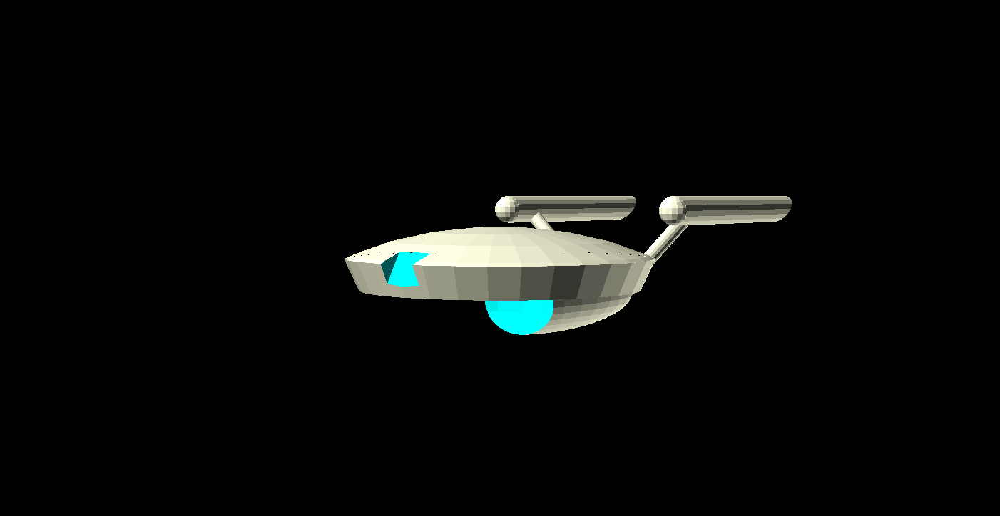
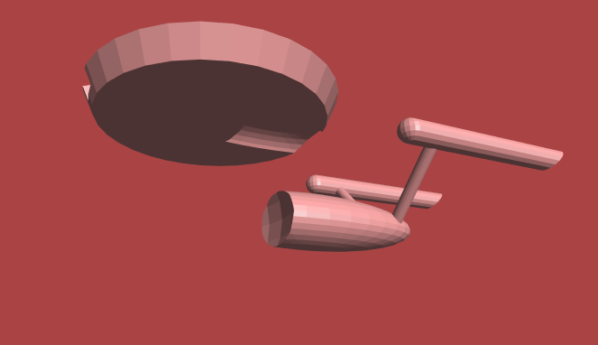

# OpenSCAD designs

Star Trek type starships

## Exodus Class

Exodus Class Super Heavy Cruiser/Carrier

### Stats

 * Length: 1500m
 * Width: 800m
 * Height: 220m
 * Decks: 36
   * Saucer Section: 20 decks (8 decks + 12 decks hangar)
   * Sphere Section: 30 decks
   * Engine Section: 22 decks
   * Warp Pylons: 24 decks (maintenance only)
   * Warp Nacelles: 6 decks (maintenance only)
 * Auxillary Craft - Large:
   * 8 *Photon Class* Light Explorer/Scout vessels
   * 24 *Vulture Class* Light Escort vessels
   * 1 *Spock Class* Diplomatic Heavy Yacht

### Description

At a kilometer and a half long, the *Exodus Class* is an incredible 
behemoth. Equipped with transwarp engines, The *Exodus* is meant to 
transport daughter ships to another quadrant - or even beyong the Galaxy
and act as a starship, starbase and fleet HQ all in one.

The 800m wide saucer section is bigger than the biggest ships so far by
itself, and is split into 16 sectors, each sector containing a massive
hangar in the lower section and livable area in the upper section. All in 
all it's big enough to be a city by itself.

The *Exodus Class* cruises at a sedate warp 4, and can move at warp 5 
when the engine is at maximum warp; which it never will be since the 
primary mode of propulsion for this juggernaut is transwarp.

The *Exodus Class* is built to work without access to a starbase for up to 
twenty years - in fact, with industrial replicators on board this ship 
serves as starbase to itself and the ships contained in it.

The *Exodus Class* isn't going to win any beauty contest - nor for that
matter any races at warp - but it does a job no other ship can do.

### Saucer Separation

Because of the highly unique nature of the *Exodus* the designers had to rethink the
concept of saucer separation completely. When deciding if saucer separation was
needed at all, the design committee looked into when the separation was actually needed in
practice

#### When the ship needs to be in two places at once

This was trivially rejected since with all the auxillary ships, the *Exodus* could be in as
many as 38 different places if needed.

#### To evacuate the civilians in case of threat

Here the committe looked at conventional saucer separations and found a bunch of things 
backwards

 * The part which needs to run away from danger, is not the part which has warp.
 * The crew which needs to command the part which fights the threat, are placed smack in the middle of the part which runs away. They have to spend precious minutes getting to another part of the ship under times of threat.
 
Considering all that, the committee turned around the convention - the saucer is the part
which separates to fight the threat, and the rest of the ship - the part with warp and transwarp - runs away
with the civilians.

The upper four decks of the sphere section contains the command crew, phaser arrays, photon torpedoes and a warp core.
When separated this becomes a sort of super-*Vulture Class* to face any threat while the rest of the *Exodus* retreats to
safety.

## Photon Class

Photon Class Light Explorer/Scout

### Stats

 * Length: 195m
 * Width: 66m
 * Height: 31m
 * Decks: 7
   * Saucer Section: 3 decks
   * Engine Section: 4 decks
 * Auxillary Craft:
   * 2 Small Shuttles
   * 1 Work Bee

### Description

The *Photon Class* is the workhorse of the *Exodus* mini-fleet. Fast, agile
and reasonable powerful, this ship is supposed to do the bulk of the exploring
on any mission.

The *Photon Class* is built for speed and it shows in the smooth ergonomic
design of the starships. It cruises comfortably at warp 9, and can do 9.99 
when you put your foot down.

The *Photon Class* has comfortable labs and bridge, but no holodecks and
everyone has to double up for the bunk beds - even the captain. The shuttle
bay on this ship is one of the smallest on any starship but it can hold two
small shuttles, and a workbee for any external repair work.

The *Photon Class* typically rendezvous with the *Exodus* mothership after 
every mission or so, but it follows the *Voyager Protocol* and can work without
access to a starbase for up to three years.

The *Photon Class* is designed to be everything you would expect in a starship
and to also fit in the hangar of an *Exodus Class*.

## Vulture Class

Vulture Class Light Escort

### Stats

 * Length: 47m
 * Width: 26m
 * Height: 9.8m
 * Decks: 2.5 (2 decks + 1 "attic" cargo hold)
 * Auxillary Craft: None

### Description

The *Vulture Class* is not just named after a bird of prey - for all practical purposes
it is a Bird of Prey built to Star Fleet specifications.

The *Vulture Class* occupies a unique niche in starship where a runabout or a fighter craft
just doesn't cut it, but a *Defiant Class* or equivalent isn't really readily available.
Typical deployment of these vessels is aboard a starbase, and typical missions involve 
escorting a larger vessel through troubled space. And coming back alone.

The *Vulture Class* might be small compared to most of the ships it will face, but it packs 
a mean punch in it's complement of phasers and torpedoes - and as if that were not enough, 
like the pack bird it's named after, the *Vulture Class* typically operates in teams of 
two or three. The multi vector attack patterns more than make up for any disadvantage 
the *Vulture Class* might have in battle.

Unlike the other ships of the *Exodus*, the *Vulture Class* wasn't designed specifically for it.
The *Vulture* has seen several notable battles, and was added as a tried and tested veteran
to the *Exodus* line-up.

In *Exodus* missions, the *Vulture* will typically be deployed in case a *Photon* runs into 
trouble it can't run out of. The *Vulture* is the cavalry, using it's top speed of warp 9.95 to
arrive at the right moment to rescue.

## Spock Class

Spock Class Diplomatic Heavy Yacht

### Stats

 * Length: 73.5m
 * Width: 40m
 * Height: 18.5m
 * Decks: 3
   * Saucer Section: 2 decks
   * Engine Section: 2 decks
 * Auxillary Craft: None

### Description

Other ships have Captain's Yachts for special diplomatic missions. The *Exodus*, with hangars to spare, didn't see
the need to hide a ship in the body contours of the ship.

The *Spock* takes diplomatic crafts to a whole new level. Named after a famous ambassador, the *Spock* is also
designed to resemble the ship he was most famous for being in - the *Constitution Class* of the 23rd century. The
*Constitution Class*, which still holds the record for maximum first contacts by any class of ships, was the first
sight of starfleet and the federation for several species in the Alpha Quadrant. The *Spock Class* hopes to be the
same to new civilizations wherever the *Exodus* is deployed.

Cruising at a respectable warp 7.5, and capable of maxing it out to warp 9.1, the *Spock* is fast despite not really
being built for speed. The *Spock* was defintely designed for luxury, and unlike the *Exodus* itself, it *was* designed
to win beauty contests - and the *Spock* does a great job of giving a first impression.

### Saucer Separation

The *Spock* is the only auxillary vessel on the *Exodus* which has a saucer separation feature. Since the *Spock* doesn't have any auxillary vehicles of itself, the impulse capable saucer section separates and can land on a planet - or a hangar of another ship. And the engineering section remains behind, in case a bailout is needed.

