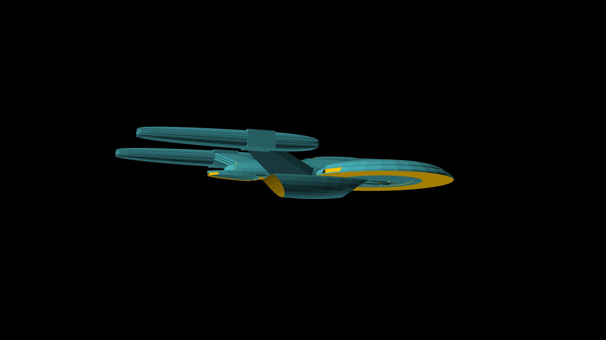
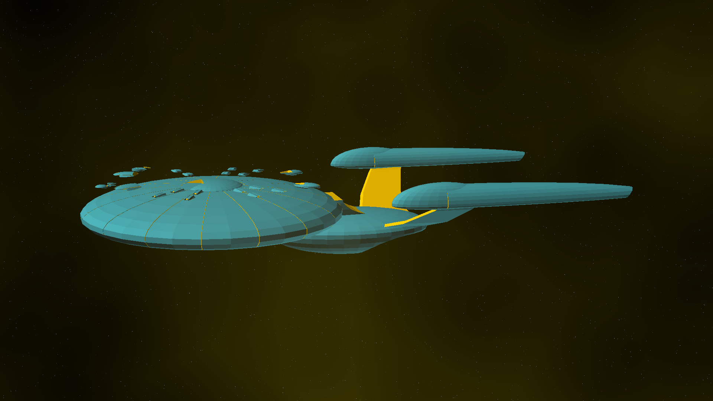
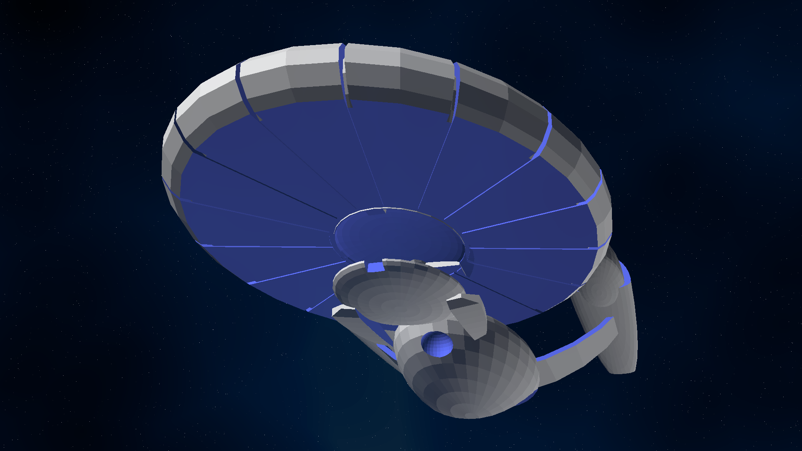
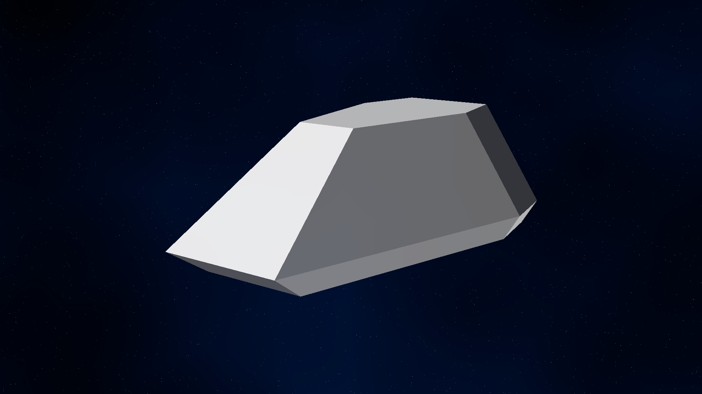
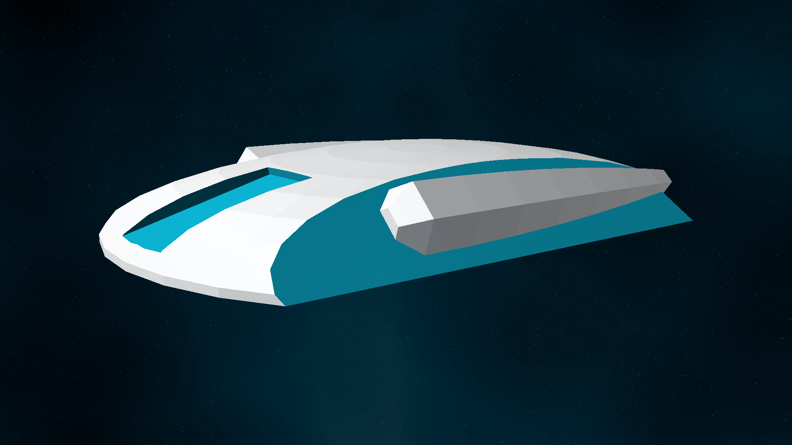
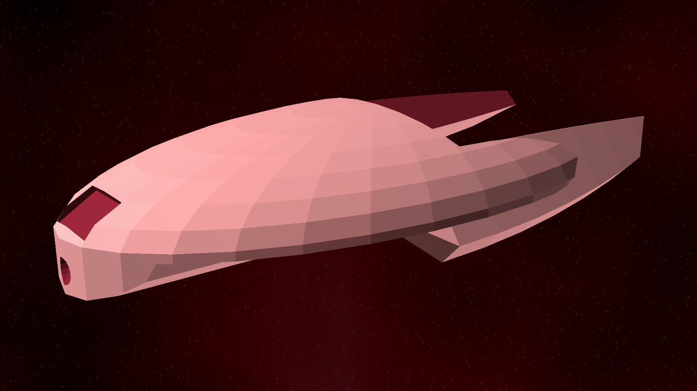
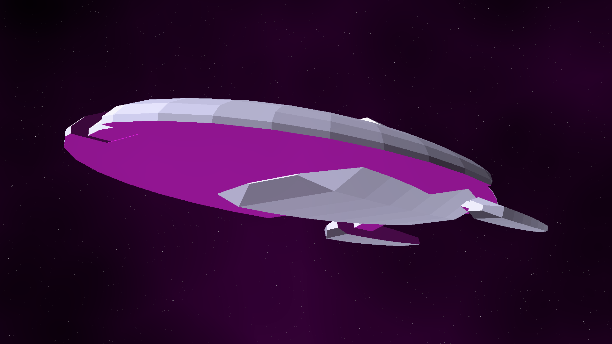
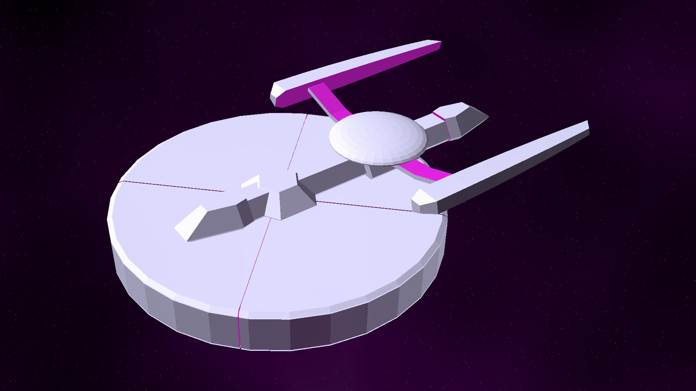
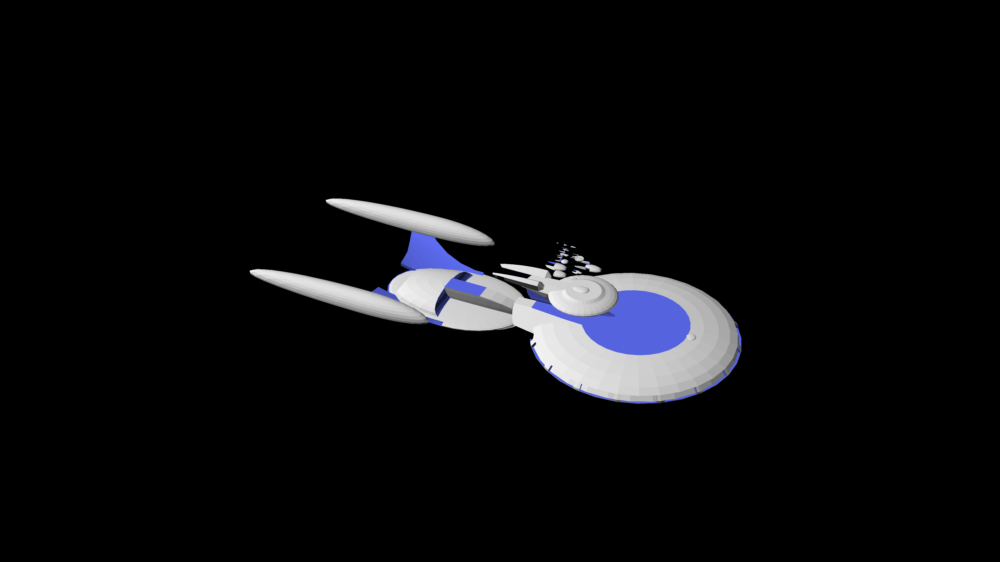

# Starship Designs

Star Trek type starships

## Aviary Class

[View 3d](https://github.com/prasannax1/starships/blob/master/stl/mother.stl)

Aviary Class Deep Space Explorer/Heavy Cruiser/Carrier

### Stats

 * Length: 1433m
 * Width: 746m
 * Height: 204m
 * Decks: 60
   * Saucer Section: 30 decks
   * Engine Section: 30 decks
 * Warp speed:
   * Cruising: Warp 8
   * Maximum: Warp 9.6
   * Transwarp: ??

### Description

The *Aviary Class* is meant to act as both a deep space explorer, and as a mobile starbase to launch other exploration missions from. It is designed primarily for scientific missions, but like any ship designed after Wolf 359 and The Dominion War, it can also be used in military conflicts.

### Structure

The *Aviary* follows a pretty tradtional design, saucer, secondary hull and nacelles. The saucer is shaped to present a lower profile from the fore direction. It is fatter than you expect it, even on a ship this size, because most of the lower half of the saucer section consists of mobile hangars for small starship.

#### Saucer Section

The saucer section is as big as a *Galaxy* or a *Sovereign* class by itself. It is split into 4 main parts.

The top 5 decks of the saucer section consists of the upper bridge complex. It consists of main bridge, main computer core, an auxillary sickbay. It also contains offices for the civilian government and administration for the civilian and starfleet residents of the *Aviary*. It also contains a mess hall and dormitory for bridge and admin staff.

The next 20 decks of the saucer section are split up into 16 sections and a central core. The central core consists of main power coupling, turbolift routing and an auxillary computer core.

Each section contains a shuttlebay 3 decks tall in the upper half, and a hangar 5 decks tall in the lower half. Each section contains an auxillary sickbay, a brig, and a mess hall. They contain residences for the crew of all the ships in the hangar underneath, as well as residences for everyone who works in that sections. 8 of the sections contain secondary computer cores.

In addition, each section also contains areas which specialize. 

 * Section 0 is the diplomatic office. It contains residence for diplomatic guests, residences for admiralty, a dining hall and a holo conference auditorium. The upper shuttlebay has been converted into a large party hall + dining area with gardens for diplomatic functions. The lower hangar contains 3 *Dove* class yachts for diplomatic missions.

 * Section 1 is the main hospital. It also contains a quarantine area. The upper shuttle-bay is converted into additional wards and a physical therapy ground. The lower hangar contains two *Nightingale* class medevac vehicles.

 * Sections 2, 3, 5, 6, 10, 11, 13, and 14 are various science labs. The labs are reconfigurable per ship. These sections also contain 2 holodecks each, and a medium mess hall. The upper shuttlebays of each contain 10 *Magpie* class heavy runabouts, which are the primary mission craft of the *Aviary*. The lower hangars contain *White Owl* class ships in 4 of these sections (3,5,11 & 13). The lower hangars of the other sections are converted into additional labs, holodecks, residence areas, cargo holds, and in the case of the exo-botany department, a mini-forest.

 * Section 4 is auxillary engineering. It has engineering labs and a light industrial replicator. The upper shuttlebay contains 4 *Dragonfly* class shuttles modified to be tugs. The lower hangar is converted to a forge to build large scale projects and repair any damaged ships.

 * Sections 7, 8 & 9 are security. This comprises of internal security, operations, external security (tactical & defense) and security of away missions. They contains weapons locker, and barracks for security personnel all over the ship, and brig complexes. The upper shuttlebays of each contain 10 *Hawk* class tactical runabouts for ship defense and escorting away missions. The lower hangars of sections 7 & 9 each contain 3 *Vulture* class patrol vessels, to run escort for the *Aviary* itself and for tactical and wartime operations. Section 8 doesn't actually have a lower hangar, that's where the saucer section connects to the secondary hull.

 * Section 12 is auxillary guest quarters for civilian passengers. It also contains a large mess hall and a large holo-complex. Both the lower and upper bays are used to hold miscellanous security cleared and approved personal vehicles.

 * Section 15 deals with transfers. The upper shuttle bay conatins 20 *Hornet* class heavy shuttles to deal with transfer of personnel and cargo between missions. The lower hangar is coverted to a large cargo bay.

The various types of auxillary vehicles carried by the *Aviary* is shown below.

[View 3d](https://github.com/prasannax1/starships/blob/master/stl/combined.stl)

#### Captain's Yacht

In the space under the saucer traditionally used by Captain's yachts, the *Aviary* has a dedicated Escort vessel. Nicknamed the *Bat Class* (because it hangs upside down), is about as big as a *Defiant Class* and is as powerful as the *Defiant* would be if it was made today.

[View 3d](https://github.com/prasannax1/starships/blob/master/stl/ms_saucer.stl)

### "*Bat Class*" stats

 * Length: 201m
 * Width: 149m
 * Height: 20m
 * Decks: 5
 * Auxillary Craft:
   * 2 Medium Shuttles
 * Warp Speed:
   * Cruising: Warp 7
   * Maximum: Warp 9.5

#### Engineering section

The engineering section contains 26 decks. The front half is used to house the warp and transwarp cores of the ship. The aft section is used as storage. There is no shuttlebay since the *Aviary* has hangars to spare.

## Auxillary craft

The *Aviary* is home to two separate families of auxillary craft.

# MACS

The Modular Auxillary Craft System (MACS) was conceived as a result of starships losing entirely too many shuttlecraft on away missions. The aims for the MACS program were two fold:
 1. Shuttlecraft should be harder to destroy
 2. Shuttlecraft should be easier to replace
 
With these dual aims in mind, the MACS system was conceived as a set of extremely durable shuttle craft components that could nevertheless be easily replicated and assembled as per mission requirements.

## Bumblebee Class

[View 3d](https://github.com/prasannax1/starships/blob/master/stl/shuttlepod.stl)

Bumblebee class small shuttle

### Stats

 * Length: 6.4m
 * Width: 4.8m
 * Height: 2.3m
 * Warp Speed:
   * Cruising: Warp 1.2
   * Maximum: Warp 2

### Description

The Bumblebee class shuttle is the foundation of the MACS program. Not only is it a stand alone shuttle, but it also acts as the cockpit/command module for every vehicle built on the MACS program.

### Structure

The Bumblebee is approximately the size of a Type 6 shuttlecraft and is used as replacement for the Type 6 on various ships (but not on the *Aviary*; we'll come to that later). Keeping in with the stated aims of the MACS program, it has much better armor and can take enough punishment to destroy the Type 6 ten times over. 

Also in keeping with the modularity aim of MACS, apart from the two seats for pilot and co-pilot, all parts of the Bumblebee's interior can be swapped out. Right behind the cockpit area are two alcoves to the side which can be configured as replicators, weapons lockers, lavatories or just plain exits - the last one being particularly useful when the standard exit of the shuttle (at the rear) is blocked by additional modules.

The rear half of the shuttle can be configured as seating/bunks (as in the Type 6), dense passenger seating, or additional consoles.

## Magpie Class

[View 3d](https://github.com/prasannax1/starships/blob/master/stl/science.stl)

Magpie Class Light Science Vessel

### Stats

 * Length: 35m
 * Width: 24m
 * Height: 6m
 * Decks: 1
 * Auxillary Craft: 1 Shuttlepod
 * Warp Speed:
   * Cruising: Warp 4
   * Maximum: Warp 8.5

### Description

The *Magpie Class* is the workhorse of the *Aviary* mini-fleet. Fast, agile and reasonable powerful, this ship is supposed to do the bulk of the exploring on any mission.

### Structure

The upper deck is essentially a very long runabout, with the cockpit in front followed by the main transporter, computer core and engineering. The warp core of the ship is laid out horizontally in the last third of the upper deck. In the middle, the upper deck also contains an elevator to the lower deck.

Approximately above the engine, the *Magpie* also contains a disc containing a sensor array, that can be reconfigured with mission specific sensors.

The lower deck contains up to 8 big modular lab rooms which can be removed and reconfigured as per missions. It also contains residential rooms for crew and scientists, a mess hall and a sickbay. Since the ship may or may not have a medical officer on a mission, each ship has an EMH manning the sickbay.

The aft end of the lower deck contains a small shuttlebay which houses a small shuttlepod for planetary landings.

## Vulture Class

[View 3d](https://github.com/prasannax1/starships/blob/master/stl/attack.stl)

Vulture Class Light Corvette/Patrol Vessel

### Stats

 * Length: 59m
 * Width: 31m
 * Height: 11m
 * Decks: 3
 * Auxillary Craft: None
 * Warp Speed:
   * Cruising: Warp 7
   * Maximum: Warp 9.95

### Description

The *Vulture Class* is not just named after a bird of prey - for all practical purposes it is a Bird of Prey built to Star Fleet specifications.

The *Vulture Class* occupies a unique niche in starship where a runabout or a fighter craft just doesn't cut it, but a *Defiant Class* or equivalent isn't really readily available.  Typical deployment of these vessels is aboard a starbase, and typical missions involve escorting a larger vessel through troubled space. And coming back alone.

### Structure

TODO

Despite its compact appearance, the *Vulture* is built on a rather conservative pattern. It contains a saucer section and a secondary hull but they're both fused together. The Warp nacelles are attached directly to the saucer section instead of being attached by pylons.

The upper deck is essentially a runabout, with the cockpit in front followed by main transporter and replicator, dormitory, sickbay, gym and brig. The aft part of the upper deck is a small cargo bay, which extends to an upper "attic" section above the main deck 1. This cargo section is directly connected to the torpedo launchers and can be used to hold extra torpedoes, or can be configured with a sensor array if required.

Deck 2 consists of engineering, with the deflector in front, the warp core and antimatter reserve extending almost the entire length of deck 2.

The saucer section is bigger than the interiors would indicate - and the extra space is occupied by a massive phaser array and auxillary antimatter reserve.

The warp core of the *Vulture* is much more powerful than a ship of this size would indicate, and even at it's top speed of Warp 9.95 it consumes only 25% of the power output. The overpowered warp core is mainly used to power the phaser array, which is what enables the *Vulture* to take out ships several times its size without breaking a sweat.

## White Owl Class

[View 3d](https://github.com/prasannax1/starships/blob/master/stl/scout.stl)

White Owl Class Light Scout

### Stats

 * Length: 56m 
 * Width: 40m
 * Height: 10m
 * Decks: 2
 * Auxillary Craft: 2 Shuttlepods
 * Warp Speed:
   * Cruising: Warp 7.5
   * Maximum: Warp 9.5
   
### Description

The *White Owl* is a bird of prey but it is also a curious bird. Accordingly this class of ships has better defences and offences than a *Magpie*, and better sensors than a *Vulture*. The *White Owl* is deployed as an advanced scout in places where trouble is expected but discoveries are hoped.

### Structure

This ship follows a standard federation structure - saucer section, secondary hull, and warp nacelles on pylons. 

The saucer section consists of 3 decks. 

 * Deck 1 - bridge. 
 * Deck 2 - crew quarters
 * Deck 3 - modular labs, mess hall, sickbay and cargo bays.
 * Deck 4 - main engineering, shuttle bay
 * Deck 5 - main engineering, shuttle bay

The aft-most part of deck 2 & 3 contains the upper half of the warp core. Both of the engineering decks contain the lower half of the warp core in the foremost part, with the aft part of both decks joined to form the shuttlebay containing two shuttlepods.

Unlike the *Magpie* and *Vulture* classes which can be mass produced cheaply, the *White Owl* is much more expensive to manufacture. That's why the *Aviary* contains at most two of these.

## Dove Class

[View 3d](https://github.com/prasannax1/starships/blob/master/stl/diplomat.stl)

Dove Class Diplomatic Yacht/Light Courier

### Stats

 * Length: 46m
 * Width: 27m
 * Height: 10m
 * Decks: 2
   * Saucer Section: 1 deck
   * Engine Section: 1 deck
 * Auxillary Craft: None
 * Warp Speed:
   * Cruising: Warp 5
   * Maximum: Warp 7.5

### Description

With the underside of the *Aviary* taken up by a dedicated escort vessel, that still leaves the niche of a diplomatic vessel unfulfilled. The *Dove* class, which was initially designed to transport VIPs in federation territory, fits into this niche naturally.

### Structure

Even though it resembles a starship with its structure of saucer - secondary hull - warp nacelle design, the *Dove* is actually a very large yacht.

The Saucer section contains the cockpit and main deflector at the front, followed by a circular corridor surrounding a pantry area to exit into the engineering room aft. The outer side of the corridor has 4 luxury rooms, two on either side.

The engineering section conatins the main warp core and transporters.

## Nightingale Class

[View 3d](https://github.com/prasannax1/starships/blob/master/stl/hospital.stl)

Nightingale Class Light Hospital Ship

### Stats

 * Length: 65m
 * Width: 27m
 * Height: 15m
 * Decks: 4
 * Auxillary Craft: None
 * Warp Speed:
   * Cruising: Warp 7
   * Maximum: Warp 9
   
### Description

On the *Aviary* an entire sector is dedicated to sickbays, hospitals and clinics for the health and wellness of the crew within. But quite often, Starfleet is asked to extend a hand of help to other species who do not have the medical facilities to deal with it.

Enter the *Nightingale*. Named after Florence Nightingale, it is as big as a general hospital itself, it is equipped with some highly specialized medical equipment.

### Structure

The *Nightingale* looks pregnant with it's oversized aft section. The main saucer contains the bridge module, with crew dormitory instead of captain's rooms. The engineering section extends seamlessly into what looks like an oversized cargo bay, but is actually 5 decks of mobile hospital.

  * Medical transporters with highly sensitive biofilters
  * 2 separate bio-shielded quarantine areas
  * The latest of scanners
  * Gallons of biomemetic gel
  * 6 EMH and 12 EMAH (emergency medical assistant hologram)
  * 1 ECH in case the captain of the ship (nominally, the CMO of the *Aviary*) is incapacitated on mission.
  * Mobile holo-emitter kits to send EMH on missions where humanoids cannot go on.

## Relative scale of ships

[View 3d](https://github.com/prasannax1/starships/blob/master/stl/scale.stl)

