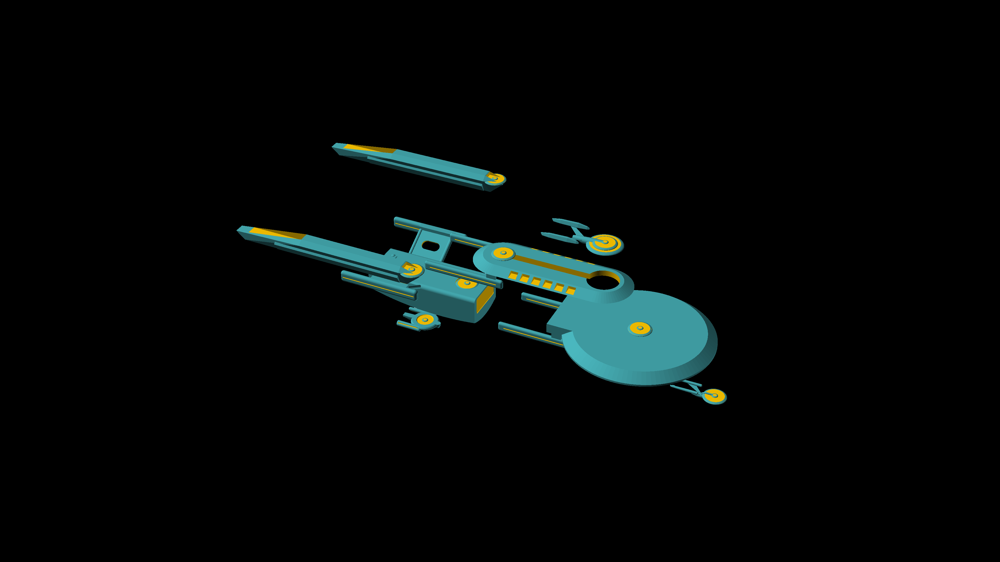
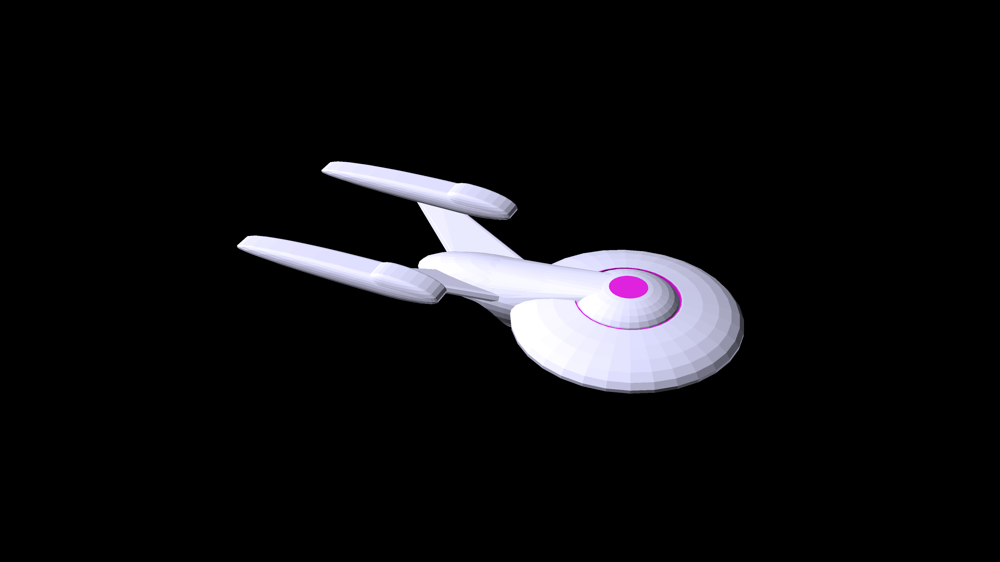
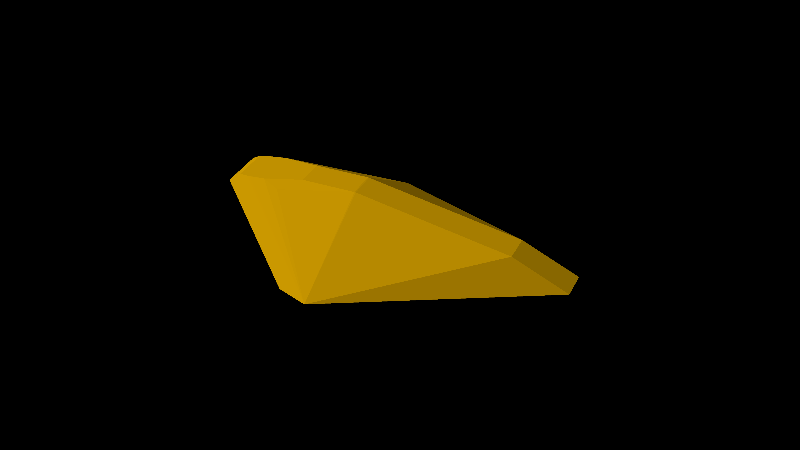

# Starship Designs

Starships and Shuttles - Star Trek style

## Atlas Class

[View 3d](https://github.com/prasannax1/starships/blob/master/stl/mother/main.stl)

Atlas Class Multi Role Deep Space Explorer and Mobile Starbase

### Stats

 - Length: 1798m
 - Width: 750m
 - Height: 249m
 - Decks: 75
 - Crew Capacity: 3000
   - Maximum evacuation limit: 75000
 - Warp Speed
   - Cruising: Warp 6
   - Peak: Warp 9.5
   - Transwarp: TW10

### Description

The Atlas class is a massive ship almost 2KM long. Nominally it's a deep space explorer,
but it is mainly used as a mobile starbase and colony transporter. A typical mission of
the Atlas class is to transwarp to unexplored space with entire colonies settled in its
massive living areas, and allow the bulk of the exploration to be done by smaller ships.
Once the exploration is done colonies are settled down and the ship returns back to 
federation territory.

The Atlas is capable of being in remote space for up to 20 years without a starbase. In 
fact, with an industrial replicator on board, the Atlas for the most part is its own 
starbase.

In practice however, Atlas ships would return to starbase at least every 5 years for 
upgrades and refits.

### History

The Atlas program was started right as the Galaxy Class was being constructed as a future
replacement for the Galaxy Class. In it's original form the Atlas was a single ship with
massive hangars combined with the main saucer that would hold *Nova* sized vessels for 
mission specific exploration.

But after the Dominion war the whole program was put on hold as Starfleet was not in favor
of sending civilians in a starship, not to mention presenting such a large target. It was 
noted that an *Atlas* (in it's original design) could carry up to 8 *Defiant* class ships,
but it was much cheaper and easier to just send 8 *Defiants* to any situation than to send
an *Atlas* and deploy them.

At the same time Starfleet was exploring the Multi-Vector Assualt paradigm, the *Atlas* team
decided to incorporate some of the principles from that approach and sell the *Atlas* as what
eventually turned out to be six separate ships that join up as one or can operate independently.

This approach was much more successful as individually, most of the components of the *Atlas* 
found enough of a niche to justify the entire ship.

### Structure

The Atlas is a fairly conventional looking starship, looking deceptively delicate due
to the scale of the ship.

The Atlas is an amalgamation of six ships, each of which can operate independently in
a specialized or generic role.

#### Atlas-A Class

[View 3d](https://github.com/prasannax1/starships/blob/master/stl/mother/command.stl)

Atlas-A Class Heavy Cruiser and Command Vessel

##### Stats

  - Length: 424m
  - Width: 199m
  - Height: 56m
  - Decks: 15
  - Crew Capacity: 250
  - Warp Speed
    - Cruising: Warp 7
    - Peak: Warp 9.8

##### Description

The Atlas-A class acts as the command module and bridge of the Atlas in regular operation
but it is a heavy cruiser capable of versatile roles.

The Atlas-A class is roughly about as big as an Excelsior and is generally used in most of
the same capacities - as the flagship of the Atlas mini-fleet and as a space control vessel.

##### Structure

The Atlas-A follows a fairly conventional primary hull, secondary hull and warp nacelles 
structure. The saucer is roughly split into these sections:

 - The 32m structure at the top is the main bridge and command module
 - The 100m wide 2 deck high structure next contains the officers quarters, sickbay and
main messhall
 - The next 200m wide 4 deck high part comntains the rest of the crew quarters, science
labs, auxillary sickbay and main computer core.
 - The 32m wide structure at the bottom of the saucer section contains the aeroshuttle 
lauch mechanism. The aeroshuttle extends to the upper deck as well.

##### Auxillary vessels

 - Type 20 small shuttles
 - Type 23 medium shuttles
 - Type 3 large shuttles
 - Pirahna Class fighters
 - Amazon Class runabouts
 - Mako class tactical runabouts

#### Atlas-B Class

[View 3d](https://github.com/prasannax1/starships/blob/master/stl/mother/transwarp.stl)

Atlas-B Class Multimission Explorer and Science and Research vessel

##### Stats

  - Length: 1572m
  - Width: 600m
  - Height: 229m
  - Decks: 66
  - Crew Capacity: 1200
  - Warp Speed
    - Cruising: Warp 8
    - Peak: Warp 9.95
    - Transwarp: TW10

##### Description

The Atlas-B class is almost a mile long by itself and is probably the part of the *Atlas* supership
that ended up saving the *Atlas* program ultimately due to how useful it was.

The B Class contains the main science labs, engineering sections and propulsion of the *Atlas* group.
And since it is designed to interface with the other sections, it has docks and ports which enable any
ship to be attached to the B Class frame, allowing it to be used as a 'transwarp taxi' for any class of
starship.

Because of this existing starships like Sovereign Class and Galaxy class could be sent to places only 
accessible through transwarp without actually modifying the ships.

##### Structure

The most notable points about the structure of the Atlas-B is that it is huge, and it is mostly just
a massive transwarp core and warp engines.

The saucer section is split into two sections, the main saucer in the rear which contains the main 
command sections and living quarters and common areas, while the ring like area in the fore contains
all the science laboratories.

They are connected by a section which contains 8 intermediate hangars (18m height x 40m width x 95m length)
for intermediate science vessels.

The aft part of the ship contains a large shuttlebay, to the fore of which is a massive cargo area almost
350m long.

##### Auxillary vessels

- Intermediate hangars
  - Orca class light corvettes
  - Raven class science vessels
  - Orbit class Yachts
- Shuttlebay
  - Type 20 small shuttles
  - Type 23 medium shuttles
  - Type 3 large shuttles
  - Amazon Class runabouts
  - Mako class tactical runabouts
  - Ganges class heavy runabouts

#### Atlas-C Class

[View 3d](https://github.com/prasannax1/starships/blob/master/stl/mother/saucer.stl)

Atlas-C Class Multimission Explorer and Super Colony Transport

##### Stats

  - Length: 998m
  - Width: 750m
  - Height: 170m
  - Decks: 50
  - Crew Capacity: 1500
  - Warp Speed
    - Cruising: Warp 6
    - Peak: Warp 8.5

##### Description

The C Class is closest to the original pre-dominion design of the Atlas. The changes would have been
the main saucer would have been 50m taller to hold a hangar for small ship, and the secondary hull would 
have been slightly larger to accomodate a transwarp core.

As it is, the C Class is built like a super Galaxy-class, with an extremely large saucer (bigger than a whole 
Galaxy class ship) which more or less contains a small city inside it.

This city contains long term residence for colony members intended to extreme long term transport, as well as 
accomodation for crew of all components of the Atlas class.

##### Structure

On top of the saucer is the main command area, which is a 32m bridge section followed by a 
100m wide, two deck area just like in the A-Class.

The next section is the main saucer itself, which is 750m wide and 50m tall. The top 3 decks
are dedicated to the main shuttlebay, which is a 200m wide ring all round. The shuttlebay
has three doors, one in the fore and two in the aft. The remaining decks
of the saucer (12) have living areas, schools, colleges, hospitals, parks, etc.

The secondary hull seems tiny next to the saucer of the C class, but it is quite large in fact.

##### Auxillary vehicles

- Type 3 large shuttles
- Amazon Class runabouts
- Mako class tactical runabouts
- Ganges class heavy runabouts
- Orca-A class heavy tactical runabouts

#### Atlas-D Class

[View 3d](https://github.com/prasannax1/starships/blob/master/stl/mother/scout.stl)

Atlas-D Class Light Cruiser and Explorer

##### Stats

  - Length: 222m
  - Width: 99m
  - Height: 42m
  - Decks: 10
  - Crew Capacity: 100
  - Warp Speed
    - Cruising: Warp 4
    - Peak: Warp 9.1

##### Description

The D-Class was also concieved at the beginning of the Atlas design process, as the Atlas collection needs a
diplomatic cruiser for the following two reasons:

1. Taking the whole ship to a potentially hostile situation will be risky for the civilian passengers
2. Overwhelming a first contact situation with a kilometer long ship might be overkill and potentially send the wrong message

The D-Class is a light cruiser about the size of a Nova class. It can be used as a stand-alone multimission explorer, but with
the Atlas collection is typically used as a first-contact mission diplomatic ship.

##### Structure

Despite having to be attached to another ship, the D-Class is built conventionally - quite possibly the most conventional looking
ship in the entire Atlas collection. This is a deliberate decision as the D-class is meant for first contact missions and so is
designed to look very representive of Starfleet and Federation.

The saucer section has a 32m wide integrated bridge and command section. This is followed by the main saucer which is 100m wide and 
two decks tall. The lower section of the saucer has a 32m wide sensor array which also houses the main phasers.

The secondary hull is fairly minimal and fucntional; the engineering section followed by a small shuttlebay.

##### Auxillary vehicles

- Bumblebee class Shuttlepods
- Type 20 small shuttles

#### Atlas-E Class

[View 3d](https://github.com/prasannax1/starships/blob/master/stl/mother/carrier.stl)

Atlas-E Class Super carrier and dreadnought

##### Stats

  - Length: 590m
  - Width: 248m
  - Height: 161m
  - Decks: 48
  - Crew Capacity: 250
  - Warp Speed
    - Cruising: Warp 3
    - Peak: Warp 7

##### Description

The E-class came about when the original Atlas had its hangars removed from the saucer section to form the Atlas-C class.

The hangars were incorporated into it's own ship and converted into a super carrier class.

At 75m tall, 150m wide and 350m long the main hangar is big enough to hold full sized ships like an *Intrepid* or a 
*Constitution* class. Or two *Defiants*. In practice it can hold multiple *Mako* class tactical runabouts for a deadly
strike force.

The ship contains its owm industrial replicator and is used as the main ship factory of the *Atlas* group.

##### Structure

The ship structure resembles the structure of the Oberth Class if the bars connecting the primary hull to the secondary
hulls were converted to entire walls to form the main hangar.

The main saucer is integrated with the engineering section, followed by the hollow section of the main hangar, and at the
bottom is the man cargo bay and antimatter storage.

##### Auxillary vehicles

- Full size vehicles
  - Intrepid class cruiser
  - Constitution class cruiser
  - Saladin/Hermes class
  - Nova class cruiser
  - Defiant class escort
  - Steamrunner class escort
  - Norway class
  - Saber class

- Intermediate ships
  - Orca class light corvettes
  - Raven class science vessels
  - Orbit class Yachts

- Shuttles
  - Mako class tactical runabouts
  - Pirahna class fighters

#### Atlas-F Class

[View 3d](https://github.com/prasannax1/starships/blob/master/stl/mother/escort.stl)

Atlas-F Class Escort Carrier

##### Stats

  - Length: 199m
  - Width: 110m
  - Height: 30m
  - Decks: 6
  - Crew Capacity: 50
  - Warp Speed
    - Cruising: Warp 7
    - Peak: Warp 9.9

##### Description

The F class is a dedicated escort vessel for the Atlas group.

It is comparable to a *Defiant* in size and function and is built with two aims in mind:
1. Fit in the space between the nacelles of the E-class
2. Not win any beauty contests

##### Structure

The F-class is built tight, with the warp core integrated into the primary saucer. 

The space between the nacelles is entirely a cargo bay cum hangar which can hold multiple
wings of *Pirahna* class fighters, or loads of photon torpedoes depending on mission profile.

##### Auxillary vehicles

- Pirahna class fighters
- Mako class tactical runabouts
- Type 20 small shuttles

### Intermediate auxillary vehicles

These are vehicles that are too big to be  a shuttle or a runabout, but smaller than even the small ships.

These are ships which lie in the 50m to 100m range.

#### Raven class

[View 3d](https://github.com/prasannax1/starships/blob/master/stl/aux/science.stl)

Raven class science ship.

##### Stats

  - Length: 85m
  - Width: 36m
  - Height: 12.5m
  - Decks: 4
  - Crew Capacity: 25
  - Warp Speed
    - Cruising: Warp 6
    - Peak: Warp 8.8

##### Description

The *Raven* class occupies a functional niche in between a runabout and a full size starship. It's meant to
go on missions of exloration alone, but will not be able to handle deep space for more than a couple of months.

For its size the *Raven* is chock full of labs. It's also built to limp back from damage that can destroy bigger 
ships, since the typical usage for this ship is to go where a full sized starship is too large to go.

##### Structure

As the *Raven* is in between a runabout and a full size starship in functionality so it is in structure - and you
can see elements of both from the shape.

The topmost deck contains a hybrid bridge cum cockpit. The subsequent decks in the 'saucer' section have the labs,
living quarters, messhall, sickbay, etc. The saucer section is followed by the engineering section which continues
into what is quite a large shuttlebay for this size of ship.

##### Auxillary vehicles

- Type 20 small shuttles
- Bumblebee Shuttlepods

#### Orca class

[View 3d](https://github.com/prasannax1/starships/blob/master/stl/aux/attack.stl)

Orca class light corvette

##### Stats

  - Length: 86m
  - Width: 25m
  - Height: 12m
  - Decks: 3
  - Crew Capacity: 12
  - Warp Speed
    - Cruising: Warp 8
    - Peak: Warp 9.9

##### Description

After the Dominion war Starfleet felt the need for ships that are substantially larger than the *Peregrine* class
fighters, but still smaller than full size starships. The *Defiant* was famously effective but even that was too
big to effectively engage the Jem'Hadar attack fighters.

The Orca was conceived as an intermediate spacecraft that ewould be cheap to build and deploy in numbers, but still 
durable and deadly enough to make an impact. The design team also decided to use the Orca as a proof of concept that
the Multi-Vector paradigm scales down to smaller ships.

This makes the Orca a small and deadly ship that can occasionally be two small and deadly ships.

##### Structure

The Orca is structured like a conventional attack ship, with a primary hull inline with the secondary hull and engine
nacelles trailing behind and below.

As mentioned before, the Orca also splits up into two ships, each of which are worth exploring on their own.

##### Orca-A class

[View 3d](https://github.com/prasannax1/starships/blob/master/stl/aux/attack-primary.stl)

Orca-A class heavy tactical runabout

  - Length: 46m
  - Width: 25m
  - Height: 6m
  - Decks: 2
  - Crew Capacity: 9
  - Warp Speed
    - Cruising: Warp 8.5
    - Peak: Warp 9.5

The Orca-A class is a stand-alone heavy tactical runabout that can hold three shifts of 3 crew. It's not as
roomy as its dimensions might indicate since large sections of deck 2 are taken up by the phaser batteries.

The Orca-A can land on a planet's surface.

When the A class is coupled up with the B class to form the entire Orca ship, the A-class warp core is fully
dedicated to powering up the phaser batteries. 

##### Orca-B class

[View 3d](https://github.com/prasannax1/starships/blob/master/stl/aux/attack-secondary.stl)

Orca-B class torpedo boat

  - Length: 56m
  - Width: 22m
  - Height: 12m
  - Decks: 3
  - Crew Capacity: 3
  - Warp Speed
    - Cruising: Warp 6.2
    - Peak: Warp 9.9

The Orca-B class is technically stand-alone but practically much less so than the A-class.

Structurally the B class is a small starship sized warp core and engines connected to a runabout
sized living quarters.

##### Auxillary vehicles

The Orca class contains a single *Bumblebee* class shuttlepod which enters and leaves the ship 
through a bay door on the bottom side of the primary hull. During separation this lies entirely
in the A-class.

The B-class has no auxillary vehicles.

#### Orbit class

[View 3d](https://github.com/prasannax1/starships/blob/master/stl/aux/diplomat.stl)

Orbit class yacht

##### Stats

  - Length: 78m
  - Width: 36m
  - Height: 13.5m
  - Decks: 4
  - Crew Capacity: 30
  - Warp Speed
    - Cruising: Warp 5
    - Peak: Warp 8.2

##### Descriptions

The Orbit class was designed when it was noticed that on most ships the Captain's yacht was seldom
used for the diplomatic functions it was intended for. The ship design team went about designing 
what a yacht would require for diplomatic missions.

##### Structure

The yacht looks like a full size shape at first glance. This is a deliberate choice, and for similar
reasons as the Atlas-D class itself - it  was deciced that a starfleet first contact vessel should
look like a starfleet vessel.

The interiors of the vessel are fairly conventional except that instead of science labs the saucer 
section has large luxury accomodations. In effect this is a glorified taxi ship although it does
not lack sensors or scientific capabilities.

##### Auxillary vehicles

- Bumblebee Class shuttlepod

### Conventional auxillary vehicles

These are regular sized shuttles and and runabouts.

#### Bumblebee class

[View 3d](https://github.com/prasannax1/starships/blob/master/stl/aux/shuttlepod.stl)

Bumblebee Class Shuttlepod

##### Stats

  - Length: 3m
  - Width: 2.5m
  - Height: 1.8m
  - Crew Capacity: 2
  - Warp Speed: no

##### Description

The Bumblebee is a minimal shuttlepod that is built to safely take two people from orbit
to a planet's surface, and then safely back.

The Bumblebee has another property that it is extremely small. Hence it is used as auxillary
ship in intermediate and small starships.

#### Type 20 class

[View 3d](https://github.com/prasannax1/starships/blob/master/stl/aux/shuttle-small.stl)

Type 20 small shuttle

##### Stats

  - Length: 6m
  - Width: 3.3m
  - Height: 2.5m
  - Crew Capacity: 6
  - Warp Speed
    - Cruising: Warp 1.5
    - Peak: Warp 2.7

##### Description

The type 20 is the standard workhorse shuttle of the federation. It is not glamorous or special
but it gets the job done.

The Type 20 is found throughout starfleet on small and medium starships.

#### Type 23 Shuttle

[View 3d](https://github.com/prasannax1/starships/blob/master/stl/aux/shuttle-medium.stl)

Type 23 medium shuttle

##### Stats

  - Length: 12m
  - Width: 6.6m
  - Height: 2.5m
  - Crew Capacity: 15
  - Warp Speed
    - Cruising: Warp 2.1
    - Peak: Warp 3.5

##### Description

The Type 23 is a larger shuttle than the type 20. It has all the equipment in correspondingly larger
quantities and capabilities.

The Type 23 is also ubiquitous in medium and large starships.

#### Type 3 large shuttle

[View 3d](https://github.com/prasannax1/starships/blob/master/stl/aux/shuttle-large.stl)

Type 3 large shuttle

##### Stats

  - Length: 18m
  - Width: 10m
  - Height: 3.2m,
  - Crew Capacity: 25
  - Warp Speed
    - Cruising: Warp 3.2
    - Peak: Warp 5.6

##### Description

At 18m long the Type 3 is more of a mini-runabout than a shuttle. 

It is frequently found in medium starships as a runabout, and in large and very large starships as shuttle.

#### Pirahna Class Fighter

[View 3d](https://github.com/prasannax1/starships/blob/master/stl/aux/fighter.stl)

Pirahna class fighter

##### Stats

  - Length: 12.3m
  - Width: 7.9m
  - Height: 2.4m
  - Crew Capacity: 2
  - Warp Speed
    - Cruising: See Note
    - Peak: Warp 9.5

##### Description

The Pirahna class is an atmospheric and exo single or double occupancy fighter meant for planetary and star system defence.

This means that although it has warp, its only used to warp at maximum speed to any part of a star system to start engaging the 
enemy. All the manouvers happen at impulse speeds after that.
