# Starship Designs

Star Trek type starships

## Aviary Class

[View 3d](https://github.com/prasannax1/starships/blob/master/stl/mother.stl)

Aviary Class Deep Space Explorer/Heavy Cruiser/Carrier

### Stats

 * Length: 1433m
 * Width: 746m
 * Height: 204m
 * Decks: 60
   * Saucer Section: 30 decks
   * Engine Section: 30 decks
 * Crew Capacity:
   * Minimum (skeleton): 10
   * Minimum (sustainable): 113
   * Typical: 1200
   * Maximum (all stations filled): 7500
   * Maximum (evacuation limit): 50000
 * Auxillary Craft
   * 80 *Magpie* class runabouts
   * 30 *Hawk* class tactical runabouts
   * 20 *Hornet* class heavy shuttles
   * 16 *Raven* class heavy runabouts
   * 6 *Vulture* class patrol vessels
   * 4 *White Owl* class light scouts
   * 4 *Dragonfly* class warp tugs
   * 3 *Dove* class diplomatic yachts
   * 2 *Nightingale* class heavy medevac vehicles
   * 1 "*Bat*" class escort vessel
   * ~50 *Bumblebee* class light shuttles
 * Warp speed:
   * Cruising: Warp 6
   * Maximum: Warp 8
   * Transwarp: ??

### Description

The *Aviary Class* is meant to act as both a deep space explorer, and as a mobile starbase to launch other exploration missions from. It is designed primarily for scientific missions, but like any ship designed after Wolf 359 and The Dominion War, it can also be used in military conflicts.

### Structure

The *Aviary* follows a pretty tradtional design, saucer, secondary hull and nacelles. The saucer is shaped to present a lower profile from the fore direction. It is fatter than you expect it, even on a ship this size, because most of the lower half of the saucer section consists of mobile hangars for small starship.

#### Saucer Section

The saucer section is as big as a *Galaxy* or a *Sovereign* class by itself. It is split into 4 main parts.

The top 5 decks of the saucer section consists of the upper bridge complex. It consists of main bridge, main computer core, an auxillary sickbay. It also contains offices for the civilian government and administration for the civilian and starfleet residents of the *Aviary*. It also contains a mess hall and dormitory for bridge and admin staff.

The next 20 decks of the saucer section are split up into 16 sections and a central core. The central core consists of main power coupling, turbolift routing and an auxillary computer core.

Each section contains a shuttlebay 3 decks tall in the upper half, and a hangar 5 decks tall in the lower half. Each section contains an auxillary sickbay, a brig, and a mess hall. They contain residences for the crew of all the ships in the hangar underneath, as well as residences for everyone who works in that sections. 8 of the sections contain secondary computer cores.

In addition, each section also contains areas which specialize. 

 * Section 0 is the diplomatic office. It contains residence for diplomatic guests, residences for admiralty, a dining hall and a holo conference auditorium. The upper shuttlebay has been converted into a large party hall + dining area with gardens for diplomatic functions. The lower hangar contains 3 *Dove* class yachts for diplomatic missions.

 * Section 1 is the main hospital. It also contains a quarantine area. The upper shuttle-bay is converted into additional wards and a physical therapy ground. The lower hangar contains two *Nightingale* class medevac vehicles.

 * Sections 2, 3, 5, 6, 10, 11, 13, and 14 are various science labs. The labs are reconfigurable per ship. These sections also contain 2 holodecks each, and a medium mess hall. The upper shuttlebays of each contain 10 *Magpie* class runabouts, and two *Raven* class heavy runabouts, which are the primary mission craft of the *Aviary*. The lower hangars can contain *White Owl* class ships in 4 of these sections (3,5,11 & 13). The lower hangars of the other sections are converted into additional labs, holodecks, residence areas, and in the case of the exo-botany department, a mini-forest.

 * Section 4 is auxillary engineering. It has engineering labs and a light industrial replicator. The upper shuttlebay contains 4 *Dragonfly* class shuttles modified to be tugs. The lower hangar is converted to a forge to build large scale projects and repair any damaged ships.

 * Sections 7, 8 & 9 are Operations. This comprises of internal security, external security (tactical & defense), security of away missions and misc operations. They contains weapons locker, and barracks for ops and security personnel all over the ship, and brig complexes. The upper shuttlebays of each contain 10 *Hawk* class tactical runabouts for ship defense and escorting away missions. The lower hangars of sections 7 & 9 each contain 3 *Vulture* class patrol vessels, to run escort for the *Aviary* itself and for tactical and wartime operations. Section 8 doesn't actually have a lower hangar, that's where the saucer section connects to the secondary hull.

 * Section 12 is auxillary guest quarters for civilian passengers. It also contains a large mess hall and a large holo-complex. Both the lower and upper bays are used to hold miscellanous security cleared and approved personal vehicles.

 * Section 15 deals with transfers. The upper shuttle bay contains 20 *Hornet* class heavy shuttles to deal with transfer of personnel and cargo between missions. The lower hangar is coverted to a large cargo bay.

The various types of auxillary vehicles carried by the *Aviary* is shown below.

[View 3d](https://github.com/prasannax1/starships/blob/master/stl/combined.stl)

#### Captain's Yacht/Dedicated Escort Vessel

In the space under the saucer traditionally used by Captain's yachts, the *Aviary* has a dedicated Escort vessel. It doesn't have a class of its own as it's part of the *Aviary*, but it is nicknamed the *Bat Class* (because it hangs upside down). It is about as big as a *Defiant Class* and is as powerful as the *Defiant* would be if it was made today.

[View 3d](https://github.com/prasannax1/starships/blob/master/stl/ms_saucer.stl)

### "*Bat Class*" stats

 * Length: 201m
 * Width: 149m
 * Height: 20m
 * Decks: 5
 * Crew Capacity:
   * Minimum: 5
   * Typical: 20
   * Maximum: 150
 * Auxillary Craft:
   * 4 *Bumblebee* class light shuttles
 * Warp Speed:
   * Cruising: Warp 7
   * Maximum: Warp 9.5

#### Engineering section

The engineering section contains 30 decks. The front half is used to house the warp and transwarp cores of the ship. The aft section is used as storage. There is no shuttlebay since the *Aviary* has hangars to spare, but the cargo bay has a runway to land shuttles and unload cargo.

## Auxillary craft

The *Aviary* is home to two separate families of auxillary craft.

# MACS

The Modular Auxillary Craft System (MACS) was conceived as a result of starships losing entirely too many shuttlecraft on away missions. The aims for the MACS program were two fold:
 1. Shuttlecraft should be harder to destroy
 2. Shuttlecraft should be easier to replace
 
With these dual aims in mind, the MACS system was conceived as a set of extremely durable shuttle craft components that could nevertheless be easily replicated and assembled as per mission requirements.

## Bumblebee Class

[View 3d](https://github.com/prasannax1/starships/blob/master/stl/macs/shuttlepod.stl)

Bumblebee class small shuttle

### Stats

 * Length: 6.4m
 * Width: 4.8m
 * Height: 2.3m
 * Crew Capacity:
   * Minimum: 1
   * Maximum: 6
 * Warp Speed:
   * Cruising: Warp 1.2
   * Maximum: Warp 2

### Description

The Bumblebee class shuttle is the foundation of the MACS program. Not only is it a stand alone shuttle, but it also acts as the cockpit/command module for every vehicle built on the MACS program.

### Structure

The Bumblebee is approximately the size of a Type 6 shuttlecraft and is used as replacement for the Type 6 on various ships (but not on the *Aviary*; we'll come to that later). Keeping in with the stated aims of the MACS program, it has much better armor and can take enough punishment to destroy the Type 6 ten times over. 

Also in keeping with the modularity aim of MACS, apart from the two seats for pilot and co-pilot, all parts of the Bumblebee's interior can be swapped out. Right behind the cockpit area are two alcoves to the side which can be configured as replicators, weapons lockers, lavatories or just plain exits - the last one being particularly useful when the standard exit of the shuttle (at the rear) is blocked by additional modules.

The rear half of the shuttle can be configured as seating/bunks (as in the Type 6), dense passenger seating, or additional consoles.

### Deployment

On the *Aviary* the *Bumblebee* is not used as a shuttle, but is kept on inventory for other MACS spacecraft, and as auxillary vehicles for smaller craft.

## Wasp Class

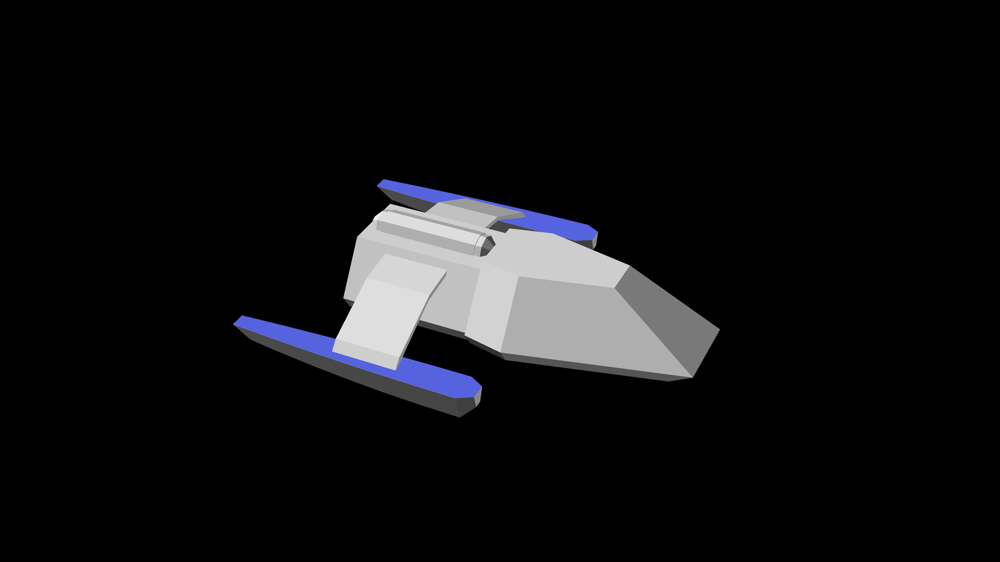

[View 3d](https://github.com/prasannax1/starships/blob/master/stl/macs/shuttle.stl)

Wasp class medium shuttle

### Stats

 * Length: 12.6m
 * Width: 9.4m
 * Height: 2.9m
 * Crew Capacity:
   * Minimum: 1
   * Maximum: 6
 * Warp Speed:
   * Cruising: Warp 3
   * Maximum: Warp 5
   
### Description

The *Wasp* class is a medium shuttle and standard inventory for light and medium cruisers in starfleet.

### Structure

The *Wasp* class adds a MACS small warp harness to the *Bumblebee*

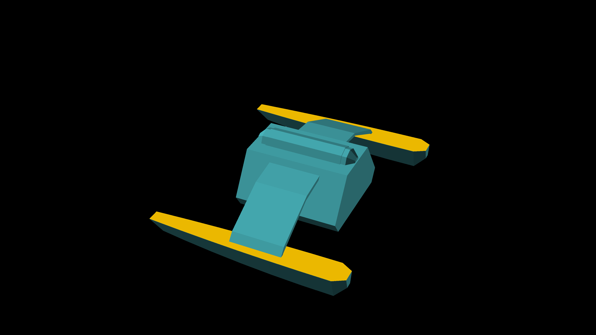

The warp harness adds a bigger warp engine, and additonal components like extra phasers and a micro torpedo launcher.

From the interiors, the warp harness adds another replicator and a transporter alcove. There's a console to access the second warp core as well.

### Deployment

The *Wasp* class is not used as a standard auxillary vehicle on the *Aviary*, nor is it maintained as inventory. However, since the components are in inventory, as *Wasp* class can be assembled if needed within minutes.

## Hornet class

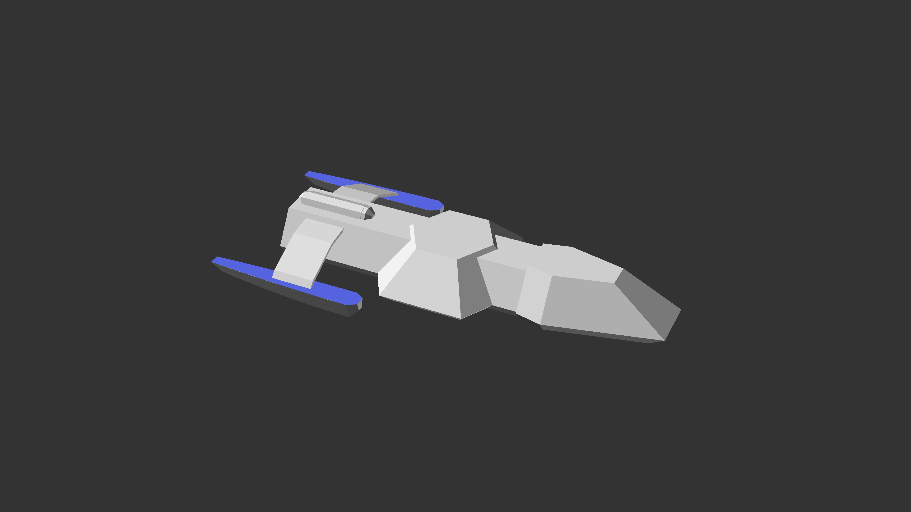

[View 3d](https://github.com/prasannax1/starships/blob/master/stl/macs/small-runabout.stl)

Hornet class heavy shuttle

### Stats

 * Length: 20.6m
 * Width: 9.4m
 * Height: 2.9m
 * Crew Capacity:
   * Minimum: 1
   * Maximum: 14
 * Warp Speed:
   * Cruising: Warp 2.1
   * Maximum: Warp 3.5

### Description

The *Hornet* class is a heavy shuttle more than 20m long, and is used as heavy shuttle on heavy and medium cruisers, and as a runabout on light cruisers.

### Structure

The *Hornet* class extends the *Wasp* by adding a MACS standard connector section in between.

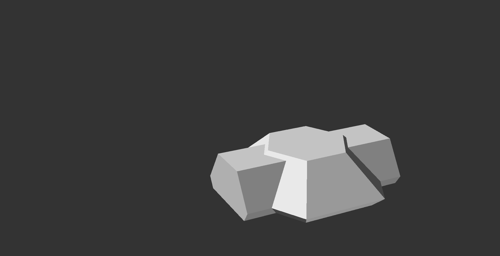

The connector section contains 4 bunk beds, a replicator, and a lavatory. It also contains an extra computer core.

However the most important function of the connector section is that it connects the MACS components to its front and its back - and also any component that might be fixed below, by means of collapsible stairs.

In case the *Hornet* is used as a runabout, the bunk beds can be swapped out for science stations as required.

### Deployment

The *Aviary* maintains an inventory of 20 *Hornet* shuttles, and uses them to transfer cargo and personnel between stations. The *Hornet* is not used for planetary or space missions except in extreme circumstances.

## Dragonfly Class

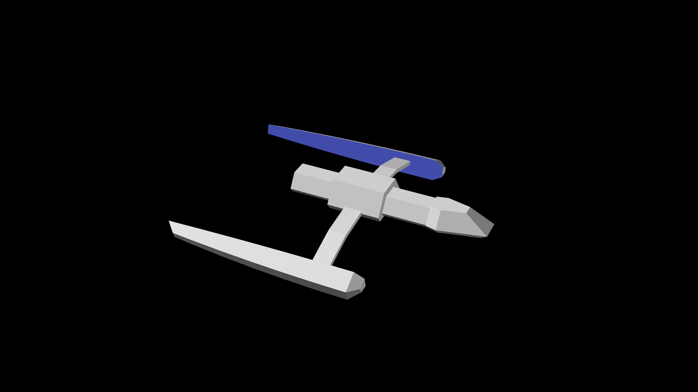

[View 3d](https://github.com/prasannax1/starships/blob/master/stl/macs/cutter.stl)

Dragonfly class heavy shuttle/cutter

### Stats

 * Length: 32.5m
 * Width: 26.5m
 * Height: 5.5m
 * Crew Capacity:
   * Minimum: 2
   * Maximum: 8
 * Warp Speed:
   * Cruising: Warp 5
   * Maximum: Warp 9

### Description

The *Dragonfly* is a small ship with a large engine. It is used as a fast courier/cutter to gain the speed of the large warp core, and is used as a tug to utilize its powerful engine.

But the most common use is to attach it to one of the MACS cargo section and use it to haul cargo.

### Structure

The *Dragonfly* attaches a MACS large warp harness to the *Bumblebee*

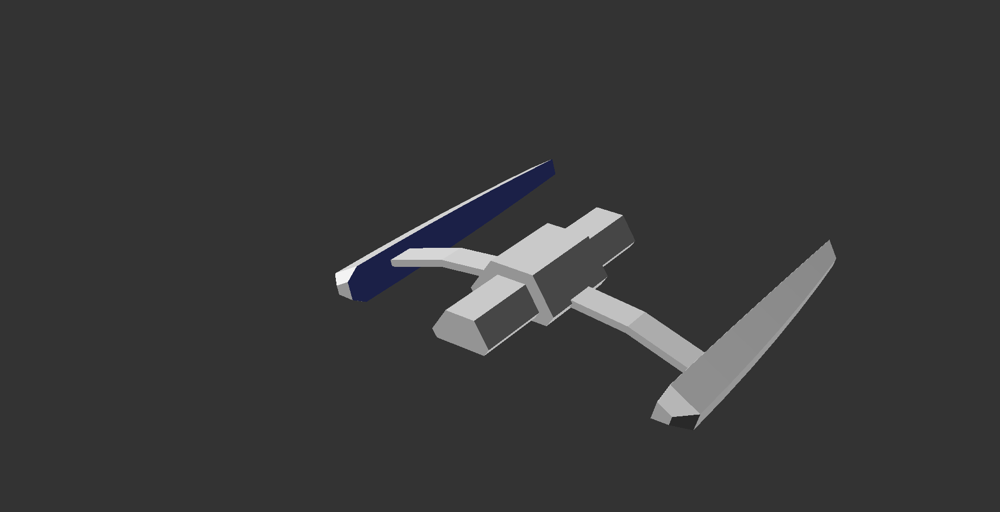

The large warp harness delivers a warp core powerful enough for a large yacht or a small starship. 

From the interiors it adds a lavatory, replicator, transporter alcove, a computer core and an engineering console.

### Deployment

On the *Aviary*, section 4 (auxillary engineering) maintains 4 *Dragonflies* used as tug vessels.

## Beetle Class

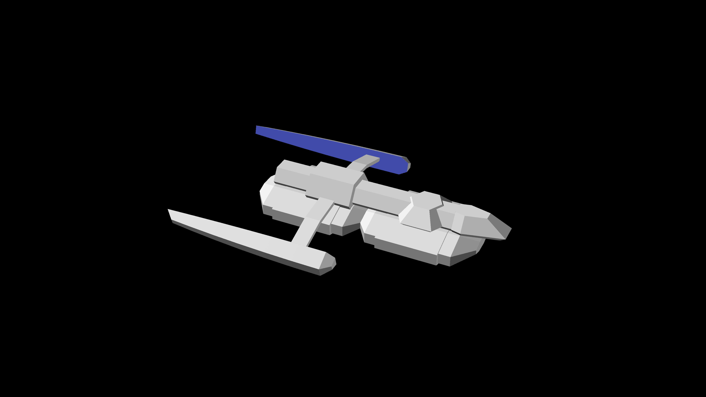

[View 3d](https://github.com/prasannax1/starships/blob/master/stl/macs/heavy-runabout.stl)

Beetle class heavy cargo shuttle/runabout

### Stats

 * Length: 40.5m
 * Width: 26.5m
 * Height: 6.5m
 * Crew Capacity:
   * Minimum: 2
   * typical: 5
   * Maximum: 35
 * Warp Speed:
   * Cruising: Warp 3.5
   * Maximum: Warp 6.2

### Description

The *Beetle* class is one of the ships that really demonstrate the power and viability of the MACS program. It's built out of the same conponents which are standard in the MACS program but it's a craft big enough to be a small starship.

### Structure

The *Beetle* class adds the MACS heavy cargo containers to what is essentially a *Dragonfly* with a MACS connector module.

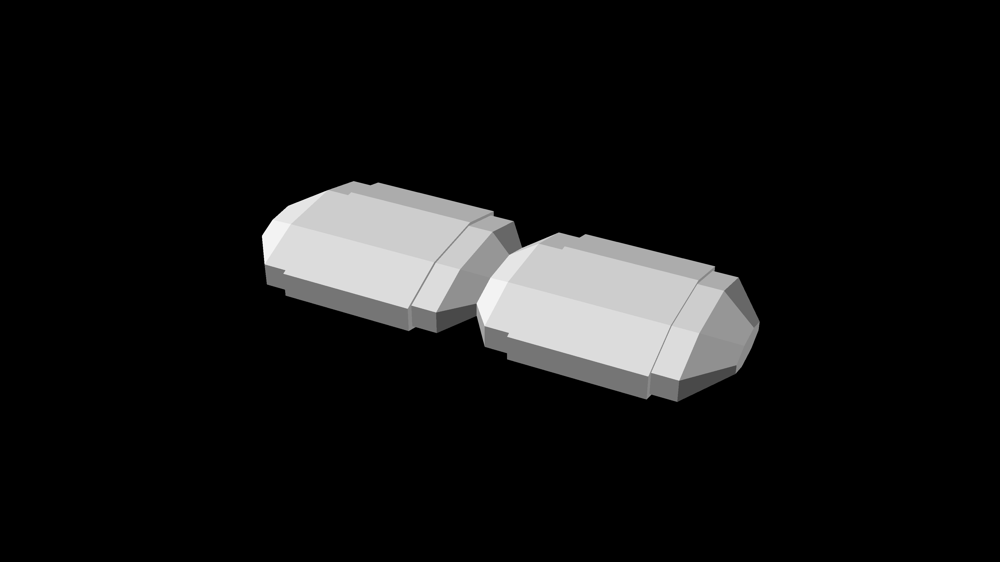

The cargo containers have independent gravity and environment systems, and can be configured to be habitable if needed. This makes the *Beetle* class not only a heavy cargo hauler, but also a heavy people hauler.

The Cargo containers can even be configured as scientific labs, and the *Beetle* class can be used as a heavy runabout, or a light science vessel.

The *Beetle* class is notorious for being used as a fast and cheap general purpose starship in remote Federation colonies.

### Deployment

The *Aviary* does not maintain an inventory of the *Beetle* class, although it can be assembled on demand to haul cargo. 

## Nightingale Class

[View 3d](https://github.com/prasannax1/starships/blob/master/stl/macs/hospital.stl)

Nightingale Class Heavy Medevac Runabout

### Stats

 * Length: 46m
 * Width: 32m
 * Height: 8.4
 * Decks: 2
 * Crew Capacity:
   * Minimum: 4
   * Typical: 10
   * Maximum: 75
 * Auxillary Craft: 1 *Bumblebee* class light shuttle
 * Warp Speed:
   * Cruising: Warp 2.3
   * Maximum: Warp 5
   
### Description

The *Nightingale* is not a true member of the MACS family, although it is built from the standard MACS components. It was built specifically as a medevac vehicle for the *Aviary*, although it has since found use in a variety of ships and stations.

### Structure

The *Nightingale* complements what is the shuttle part of a *Beetle* class with a custom medical habitat:

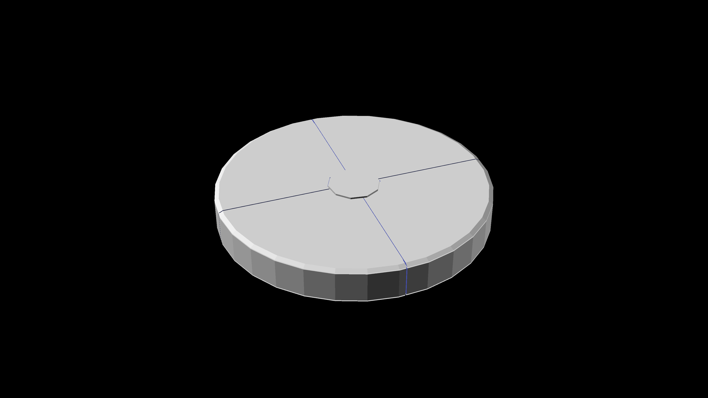

Apart from containing independent gravity and environment controls, the disk also contains

  * The latest of medical equipment and scanners
  * Up to 20 isolated patient beds
  * Medical transporters with highly sensitive biofilters
  * Holo-emitters spanning the entire breadth of the disk capable of projecting 6 independent EMH

Even though the *Nightingale* is supposed to just carry patients from affected areas to the main hospital decks of the *Aviary*, the *Nightingale* by itself acts as a fully capable small hospital.

Regarding the ship itself, there's a second MACS *Bumblebee* module attached to the rear of the large warp harness. This can be used as a secondary command module, and given that it has been configured to detach and re-attach to the harness without requiring an engineering team, can also be used as an auxillary vehicle for the *Nightingale* itself.

### Deployment

The *Aviary* carries 2 *Nightingale* vessels in the lower hangars of section 1.

# ICP

The Intermediate Craft Program (ICP) began with the following observations:

 * Starships are getting larger and larger. Starships exceeding a kilometer in length are becoming the norm.
 * As a consequence of this, the capacity of starships to carry auxillary vehicles is also increasing.
 * Consequently, auxillary vehicles are becoming larger
 * Due to miniaturization and march of technology, any ship is more powerful than a previous generation's ship of comparable size.

The ICP was started to come up with craft in the 25m to 100m range, which is too large to be a shuttle but too small to be a starship. The ICP designed vehicles should be able to be used as standalone starships or as auxillary vehicles aboard starbases and large starships.

## Magpie Class

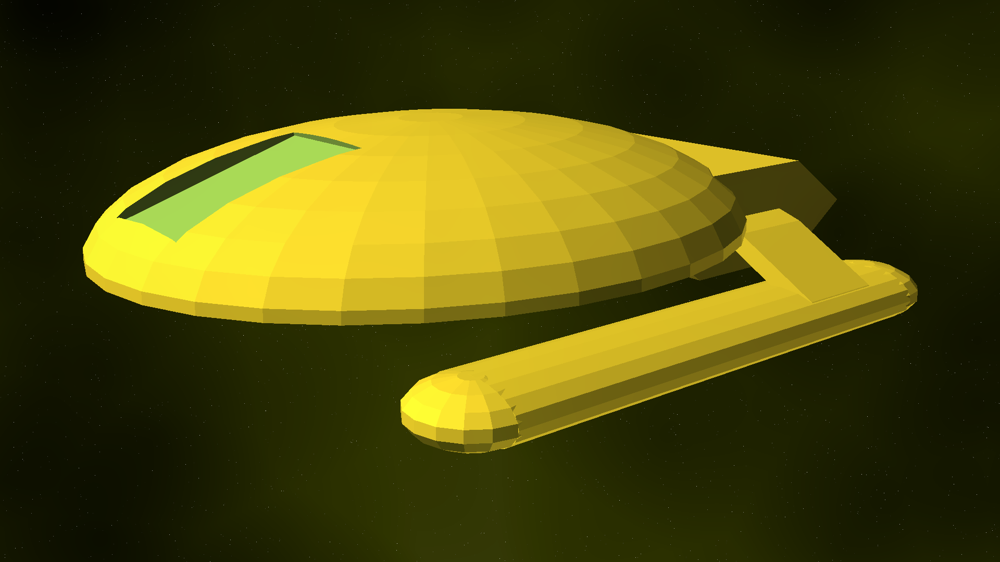

[View 3d](https://github.com/prasannax1/starships/blob/master/stl/icp/runabout.stl)

Magpie Class Scientific Heavy Runabout

### Stats

 * Length: 22m
 * Width: 13.9m
 * Height: 5.1m
 * Decks: 1.5
 * Crew Capacity:
   * Minimum: 1
   * Typical: 5
   * Maximum: 100
 * Auxillary Craft: *See note below*
 * Warp Speed:
   * Cruising: Warp 4
   * Maximum: Warp 8.5

### Description

The *Magpie* is nominally the size of a regular runabout, but because of its boxy build manages to fit twice as much capacity as a regular runabout of its size. 

### Structure

The cockpit is in the front which contains the main consoles, transporter and replicator. The cockpit ends in a stair ascending half a deck to the rest of the ship. This contains the modular units of a runabout towards the sides, and towards the center there's an open area containing a messhall and an assembly area. Aft of that, is the cargo hold, which spans the height of two decks. 

Descending down into the cargo hold, we see the doors connecting to the half second deck underneath the main deck. The center of this is occupied by a horizontal warp core, with additional modular units on the sides. 

#### Note on auxillary vehicles

The cargo hold of the *Magpie* is big enough to hold land vehicle - or even a small shuttle although it would be a tight fit. To facilitate this, the cargo bay of the *Magpie* is equipped with semi-permeable shields.

### Deployment

The *Magpie* is the standard auxillary vehicle of the *Aviary*. It is used for planetary and deep space away missions, and used as transport vehicle for personnel and cargo. The *Aviary* maintains 80 *Magpie* vessels, distributed across all science sections.

## Hawk Class

[View 3d](https://github.com/prasannax1/starships/blob/master/stl/tactical-runabout.stl)

Hawk Class tactical runabout

### Stats

 * Length: 34.5m
 * Width: 21.8m
 * Height: 4.6m
 * Decks: 1
 * Crew Capacity:
   * Minimum: 1
   * Typical: 2
   * Maximum: 50
 * Auxillary Craft: None
 * Warp Speed:
   * Cruising: Warp 5.2
   * Maximum: Warp 8.7

### Description

The *Hawk* class is basically a *Magpie* with a bigger warp core, bigger warp coils, and more weapons. This reduces the capacity of the *Hawk* class to something slightly less than a standard runabout, but that doesn't really matter in practice since this class of vessels is generally used for tactical missions rather than scientific. 

### Structure

The combat capabilities of the *Hawk* class is comparable to dedicated fighters like the *Peregrine* and the *Valkyirie*, but unlike those, the *Hawk* class is a true runabout from the inside; apart from the command section and cockpit, the *Hawk* class also contains 4 rooms and a rear cargo hold like a standard runabout.

### Deployment

Typical deployments for the *Hawk* class are aboard starbases and large starships, where they supplement or replace dedicated fighter craft. Unlike warp fighters, which have a typical range of a few hundred million KM, *Hawk* class vessels can escort craft over several star systems.

The *Aviary* maintains an inventory of 30 *Hawk* class vessels in the upper shuttlebays of sections 7, 8 and 9. They are used as first response ship defence fighters, and as escort vessels for planetary missions.
 
## Raven Class

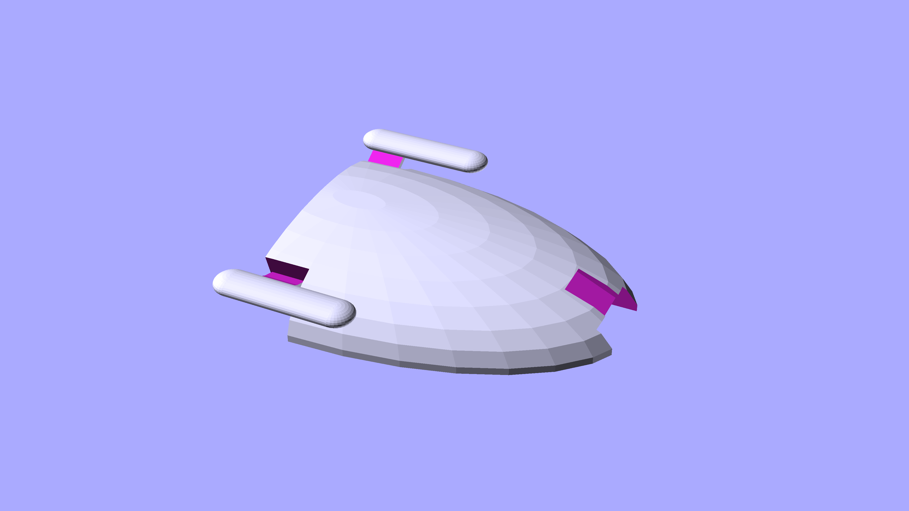

[View 3d](https://github.com/prasannax1/starships/blob/master/stl/icp/science.stl)

Raven Class Scientific Heavy Runabout

### Stats

 * Length: 39m
 * Width: 24m
 * Height: 7m
 * Decks: 2
 * Crew Capacity:
   * Minimum: 2
   * Typical: 10
   * Maximum: 200
 * Auxillary Craft: 1 *Bumblebee* class shuttle
 * Warp Speed:
   * Cruising: Warp 4
   * Maximum: Warp 8.5

### Description

The *Raven* is the first vessel created by the ICP which successfully acts as an independent ship as well as an auxillary vehicle. It is feature par with any science vessel from the pioneering age of warp travel, from the late 2100s to the early 2200s.

### Structure

The *Raven* has a very simple structure of single saucer shaped hull with warp coils at the bottom - somewhat like the ubiquitious *Miranda* class but much smaller.

Like all ships of the ICP like, the *Raven* lacks a true bridge, which is replaced by the large cockpit at the front of deck 2. This is followed by runabout like modular labs and living area - messhall, sickbay, etc. This is followed by the engine room which houses the vertical warp core which occupies both decks. This is followed by the cargo/shuttle bay, which also houses the ship's transporters. The cargo bay also spans both decks.

The front part of deck 1 has additional labs which require specialized instrumentation.

#### Auxillary vehicles.

The large aft cargo bay of the *Raven* is large enough to hold small to medium shuttles and frequently carries 1 *Bumblebee* class shuttle.

### Deployment

The *Raven* is used by the *Aviary* like any other ship would use runabouts - stand alone missions, long missions, missions spanning multiple sites, etc. The *Aviary* maintains 16 *Raven* vessels, 2 in each science sections.

## Vulture Class

[View 3d](https://github.com/prasannax1/starships/blob/master/stl/attack.stl)

Vulture Class Light Corvette/Patrol Vessel

### Stats

 * Length: 77m
 * Width: 45m
 * Height: 13.75m
 * Decks: 3
 * Crew Capacity:
   * Minimum: 4
   * Typical: 12
   * Maximum: 56
 * Auxillary Craft: *See note*
 * Warp Speed:
   * Cruising: Warp 7
   * Maximum: Warp 9.95

### Description

The *Vulture Class* is not just named after a bird of prey - for all practical purposes it is a Bird of Prey built to Star Fleet specifications.

The *Vulture* is arguably the most successful space craft built by the ICP. With a destructive power comparable to the *Constitution* class of about two centuries ago, the *Vulture* is deployed in a variety of patrol and escort roles. Within Federation space, the *Vulture* forms the first response to any threat. 

The *Vulture* can limp back from damage that would destroy much larger ships and with that it is fast developing a reputation of being the last response required as well.

### Structure

Like the *Hawk* is a *Magpie* with teeth, so is the *Vulture* a much better armed *Raven* class.

The *Vulture* contains a saucer section and a secondary hull but they're both fused together. The Warp nacelles are attached directly to the saucer section instead of being attached by pylons.

The upper deck is essentially a runabout, with the cockpit in front followed by main transporter and replicator, dormitory, sickbay, gym and brig. The aft part of the upper deck is a small cargo bay, which extends to an upper "attic" section above the main deck 1. This cargo section is directly connected to the torpedo launchers and can be used to hold extra torpedoes, or can be configured with a sensor array if required.

Deck 2 consists of engineering, with the deflector in front, the warp core and antimatter reserve extending almost the entire length of deck 2.

The saucer section is bigger than the interiors would indicate - and the extra space is occupied by a massive phaser array and auxillary antimatter reserve.

The warp core of the *Vulture* is much more powerful than a ship of this size would indicate, and even at it's top speed of Warp 9.95 it consumes only 25% of the power output. The overpowered warp core is mainly used to power the phaser array, which is what enables the *Vulture* to take out ships several times its size without breaking a sweat.

#### Note

The cargo hold of the *Vulture* can also hold a *Bumblebee* class shuttle. However it rarely carries one due to mission profiles never needing (relatively) delicate shuttles.

### Deployment

The *Aviary* contains two squadrons of 3 *Vulture* ships each. These are contained in the lower hangars of sections 8 and 9.

The *Vulture*s are used to escort the *Aviary* in flight through troubled space, and patrol the ship from a few AUs away when the ship drops to impulse. The *Vulture* is not used as a first response ship, since the massive warp core of the *Vulture* takes too long to power up from rest. 

## White Owl Class

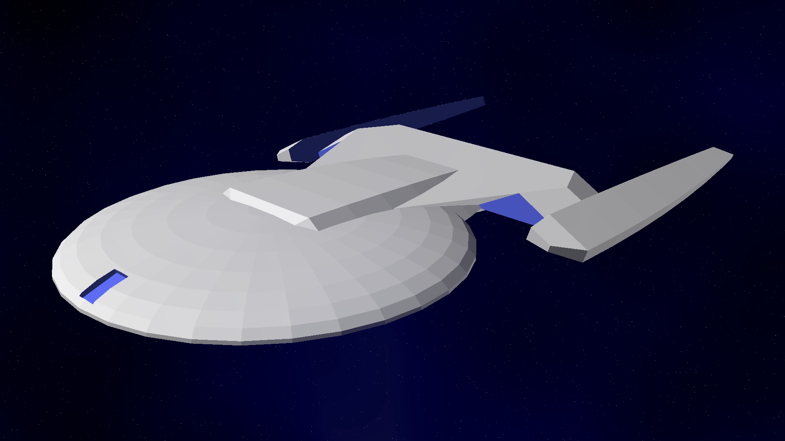

[View 3d](https://github.com/prasannax1/starships/blob/master/stl/icp/scout.stl)

White Owl Class Light Scout

### Stats

 * Length: 97m 
 * Width: 62m
 * Height: 10m
 * Decks: 3
 * Crew Capacity:
   * Minimum: 4
   * Typical: 30
   * Maximum: 120
 * Auxillary Craft: 2 *Bumblebee* class small shuttles
 * Warp Speed:
   * Cruising: Warp 7.5
   * Maximum: Warp 9.5
   
### Description

The *White Owl* is a bird of prey but it is also a curious bird. Accordingly this class of ships has better defences and offences than a *Magpie*, and better sensors than a *Vulture*.

Unlike the other ships on this page, the *White Owl* is not used as a member of the *Aviary* "fleet". The *White Owl* is meant to carry out independent missions, and only uses the *Aviary* for its transwarp engine.

### Structure

The *White Owl* has a classic "starship" structure, with saucer shaped primary hull, secondary hull and warp nacelles.

Deck 1 contains various labs, dormitories, sickbay and messhall. The front of the primary hull contains the primary deflector, and an observation lounge behind it.

The secondary hull contains the warp core spanning three decks. The rear of the secondary hull contains a shuttlebay which holds two small shuttles.

### Deployment

The *Aviary* can carry upto 4 *White Owl* vessels in the lower hangars of sections 3, 5, 11 and 13. These ships will have independent survey or exploration missions and will use the *Aviary* for its transwarp engine.

If these hangars are empty, they're used to store the *Vulture* class ships, which can get awfully crowded in hangars 7 & 9.

## Dove Class

[View 3d](https://github.com/prasannax1/starships/blob/master/stl/diplomat.stl)

Dove Class Diplomatic Yacht/Light Courier

### Stats

 * Length: 46m
 * Width: 27m
 * Height: 10m
 * Decks: 2
   * Saucer Section: 1 deck
   * Engine Section: 1 deck
 * Crew Capacity:
   * Minimum: 1
   * Typical: 3
   * Maximum: 40
 * Auxillary Craft: None
 * Warp Speed:
   * Cruising: Warp 5
   * Maximum: Warp 7.5

### Description

With the underside of the *Aviary* taken up by a dedicated escort vessel, that still leaves the niche of a diplomatic vessel unfulfilled. The *Dove* class, which was initially designed to transport VIPs in federation territory, fits into this niche naturally.

### Structure

Even though it resembles a starship with its structure of saucer - secondary hull - warp nacelle design, the *Dove* is actually a very large yacht.

The Saucer section contains the cockpit and main deflector at the front, followed by a circular corridor surrounding a pantry area to exit into the engineering room aft. The outer side of the corridor has 4 luxury rooms, two on either side.

The engineering section contains the main warp core and transporters.

### Deployment

The *Aviary* holds 3 *Dove* class yachts in the lower hangar of section 0.

## Relative scale of ships

[View 3d](https://github.com/prasannax1/starships/blob/master/stl/scale.stl)

