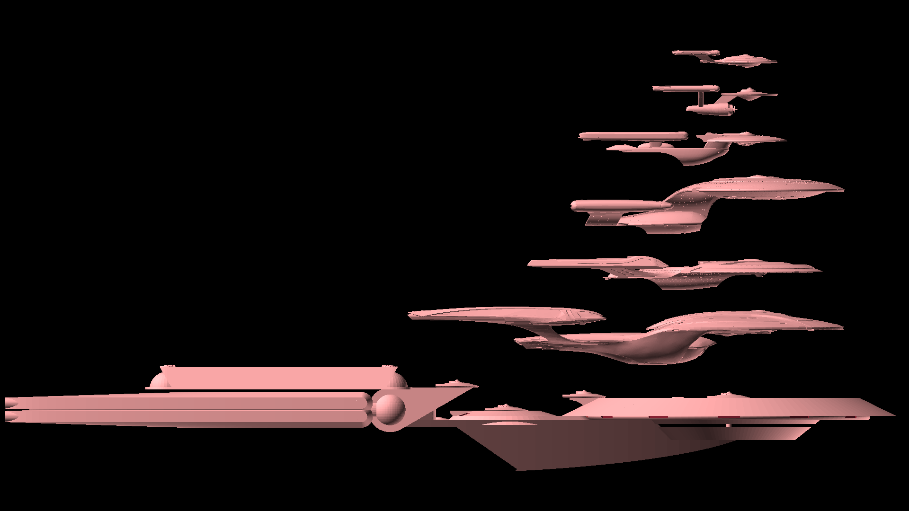
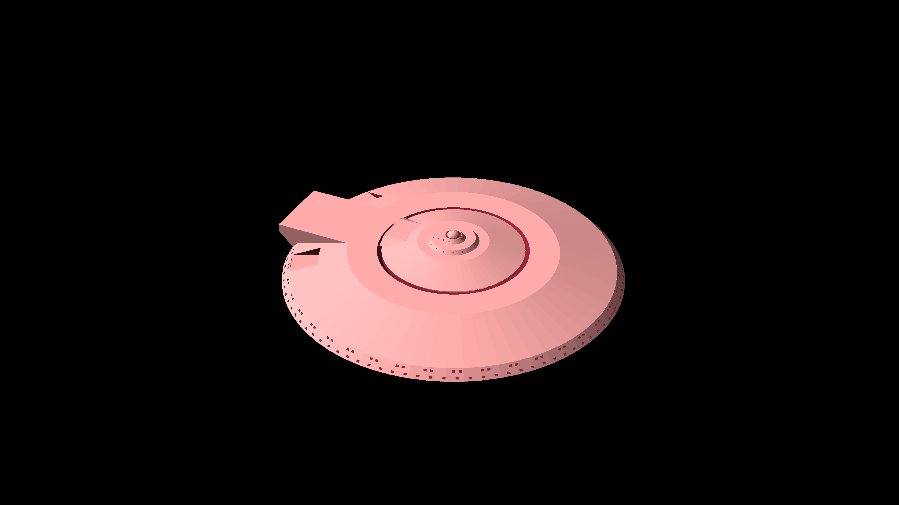

# Starship Designs

Starships and Shuttles - Star Trek style

## Atlas Class

[View 3d](https://github.com/prasannax1/starships/blob/master/stl/mother/main.stl)

Atlas Class Multi Role Deep Space Explorer and Mobile Starbase

### Stats

 - Length: 1798m
 - Width: 750m
 - Height: 249m
 - Decks: 75
 - Crew Capacity: 2500
   - Maximum evacuation limit: 50000
 - Warp Speed
   - Cruising: Warp 6
   - Peak: Warp 9.5
   - Transwarp: TW10

### Description

The Atlas class is a massive ship almost 2KM long. Nominally it's a deep space explorer,
but it is mainly used as a mobile starbase and colony transporter. A typical mission of
the Atlas class is to transwarp to unexplored space with entire colonies settled in its
massive living areas, and allow the bulk of the exploration to be done by smaller ships.
Once the exploration is done colonies are settled down and the ship returns back to 
federation territory.

The Atlas is capable of being in remote space for up to 20 years without a starbase. In 
fact, with an industrial replicator on board, the Atlas for the most part is its own 
starbase.

In practice however, Atlas ships would return to starbase at least every 5 years for 
upgrades and refits.

### History

The Atlas program was started right as the Galaxy Class was being constructed as a future
replacement for the Galaxy Class. In it's original form the Atlas was a single ship with
massive hangars combined with the main saucer that would hold *Nova* sized vessels for 
mission specific exploration.

But after the Dominion war the whole program was put on hold as Starfleet was not in favor
of sending civilians in a starship, not to mention presenting such a large target. It was 
noted that an *Atlas* (in it's original design) could carry up to 8 *Defiant* class ships,
but it was much cheaper and easier to just send 8 *Defiants* to any situation than to send
an *Atlas* and deploy them.

At the same time Starfleet was exploring the Multi-Vector Assualt paradigm, the *Atlas* team
decided to incorporate some of the principles from that approach and sell the *Atlas* as what
eventually turned out to be six separate ships that join up as one or can operate independently.

This approach was much more successful as individually, most of the components of the *Atlas* 
found enough of a niche to justify the entire ship.

### Structure

The Atlas is a fairly conventional looking starship, looking deceptively delicate due
to the scale of the ship.

The Atlas is an amalgamation of six ships, each of which can operate independently in
a specialized or generic role.

#### Atlas-A Class

[View 3d](https://github.com/prasannax1/starships/blob/master/stl/mother/command.stl)

Atlas-A Class Heavy Cruiser and Command Vessel

##### Stats

  - Length: 424m
  - Width: 199m
  - Height: 56m
  - Decks: 15
  - Crew Capacity: 400
  - Warp Speed
    - Cruising: Warp 7
    - Peak: Warp 9.8

##### Description

The Atlas-A class acts as the command module and bridge of the Atlas in regular operation
but it is a heavy cruiser capable of versatile roles.

The Atlas-A class is roughly about as big as an Excelsior and is generally used in most of
the same capacities - as the flagship of the Atlas mini-fleet and as a space control vessel.

##### Structure

The Atlas-A follows a fairly conventional primary hull, secondary hull and warp nacelles 
structure. The saucer is roughly split into these sections:

 - The 32m structure at the top is the main bridge and command module
 - The 100m wide 2 deck high structure next contains the officers quarters, sickbay and
main messhall
 - The next 200m wide 4 deck high part comntains the rest of the crew quarters, science
labs, auxillary sickbay and main computer core.
 - The 32m wide structure at the bottom of the saucer section contains the aeroshuttle 
lauch mechanism. The aeroshuttle extends to the upper deck as well.

##### Auxillary vessels

 - Type 20 small shuttles
 - Type 23 medium shuttles
 - Type 3 large shuttles
 - Pirahna Class fighters
 - Amazon Class runabouts
 - Mako class tactical runabouts

#### Atlas-B Class

[View 3d](https://github.com/prasannax1/starships/blob/master/stl/mother/transwarp.stl)

Atlas-B Class Multimission Explorer and Science and Research vessel

##### Stats

  - Length: 1572m
  - Width: 600m
  - Height: 229m
  - Decks: 66
  - Crew Capacity: 1200
  - Warp Speed
    - Cruising: Warp 8
    - Peak: Warp 9.95
    - Transwarp: TW10

##### Description

The Atlas-B class is
