# Starship Designs

Starships and Shuttles - Star Trek style

## Atlas Class

Atlas Class Multi Role Deep Space Explorer and Mobile Starbase

### Stats

 - Length: 1999m
 - Width: 750m
 - Height: 219m
 - Decks: 66 
 - Crew Capacity: 15000
   - Maximum evacuation limit: 1000000
 - Warp Speed
   - Cruising: Warp 6
   - Peak: Warp 9.5
   - Transwarp: TW10

### Description

The Atlas class is a massive ship 2KM long. 

It is mainly used as a mobile starbase and colony transporter. A typical mission of
the Atlas class is to transwarp to unexplored space with entire colonies settled in its
massive living areas, and allow the bulk of the exploration to be done by smaller ships.
Once the exploration is done colonies are settled down and the ship returns back to 
federation territory.

The Atlas is nominally intended to be on 20 year deep space missions between refits. But realistically the expectation for such ships is that once launched they become a world onto themselves, continuing exploration without intervention or support from Starfleet. Having industrial
replicators on board, the Atlas doesn't even have to be physically present at a starbase for
refits - it can download the specs and do a refit wherever it is.

### History

The Atlas program was started right as the Galaxy Class was being constructed as a future
replacement for the Galaxy Class. In it's original form the Atlas was a single ship with
massive hangars combined with the main saucer that would hold *Nova* sized vessels for 
mission specific exploration.

But after the Dominion war the whole program was put on hold as Starfleet was not in favor
of sending civilians in a starship, not to mention presenting such a large target. It was 
noted that an *Atlas* (in its original design) could carry up to 8 *Defiant* class ships,
but it was much cheaper and easier to just send 8 *Defiants* to any situation than to send
an *Atlas* and deploy them.[^defiants]

[^defiants]: Of course as Starfleet had neither a working Atlas class, nor for that matter 8 *Defiant*s, 
    the whole discussion was deemed moot.

At the same time Starfleet was exploring the Multi-Vector Assualt paradigm, the *Atlas* team
decided to incorporate some of the principles from that approach and sell the *Atlas* as what
eventually turned out to be 7 separate ship types that join up as one or can operate independently.[^multivector]

[^multivector]: It should 
    be noted that though the *Atlas* borrows heavily from Mutli-Vector Assault Vehicles, it is not 
    intended to be used as a Multi-Vector Assault vehicle. While the ship can undock its components faster than 
    a *Galaxy* class saucer separation, the ship does not have the centralized control grid that make a multi-vector 
    ship; once it splits, it becomes separate ships.

This approach was much more successful as individually, most of the components of the *Atlas* 
found enough of a niche to justify the entire ship.

### Structure

The Atlas is a fairly conventional looking starship, looking deceptively delicate due
to the scale of the ship.

The Atlas is an amalgamation of 7 types of ship, each of which can operate independently in
a specialized or generic role.

#### Atlas-A Class

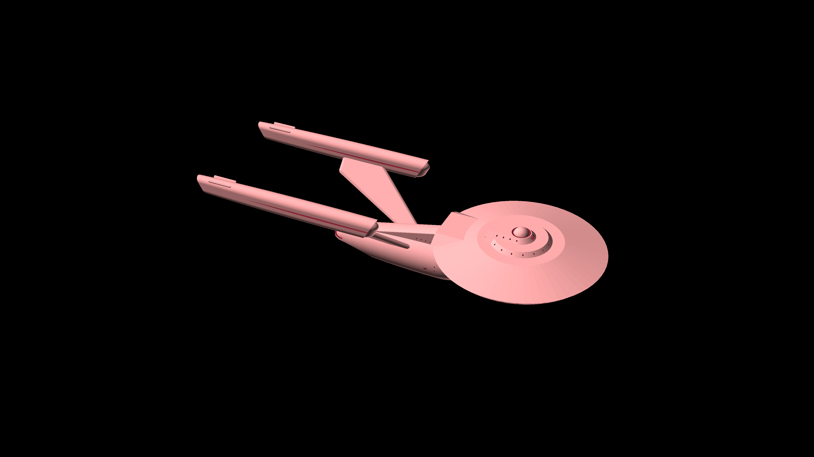

Atlas-A Class Light Cruiser and Diplomatic Vessel

##### Stats

  - Length: 239m
  - Width: 100m
  - Height: 54m
  - Decks: 16
  - Crew Capacity: 180
  - Warp Speed
    - Cruising: Warp 7
    - Peak: Warp 9.8

##### Description

The Atlas-A class acts as the command module and bridge of the Atlas in regular operation
but also doubles up as a light cruiser capable of versatile roles.

The Atlas-A class is roughly the size of a *Nova* class and used in rougly the same capabilities - as a light explorer, a command flagship or a diplomatic vessels.

the Atlas class also has multiple A class primary hulls on its other components, which can be combined with secondary hulls to form additional explorers.

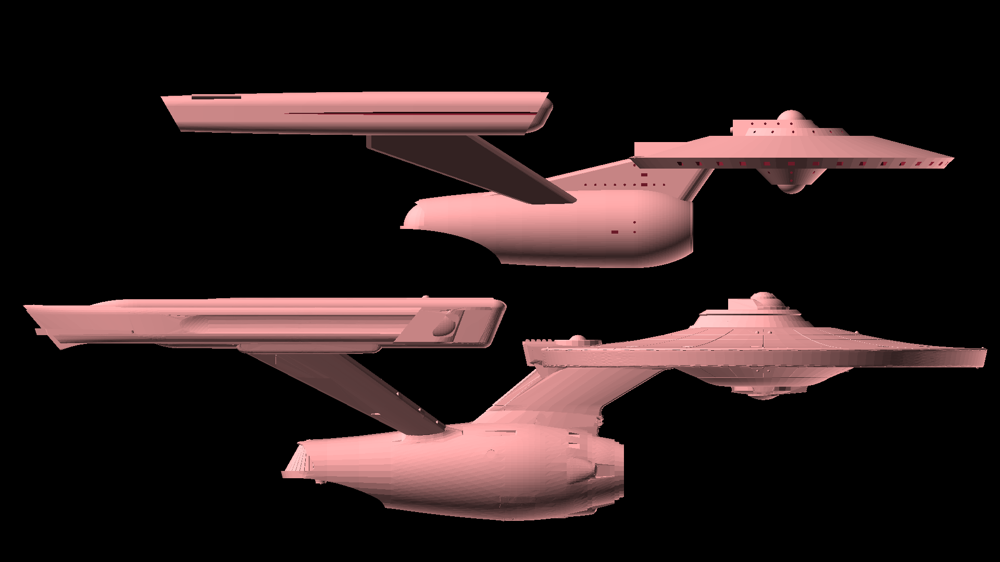

##### Structure

The Atlas-A class is built on the standard class 1 habitat

This 100mx100mx15m structure is a self contained habitat with a command bridge, various labs, living areas, common areas, sickbays, a brig and even a small shuttlebay.

The class 1 habitat has a small warp core just about enough to power the whole habitat and the impulse engine. It can be used as a standalone space or ground station, or can be combined with a class 1 warp engine to form a light scout

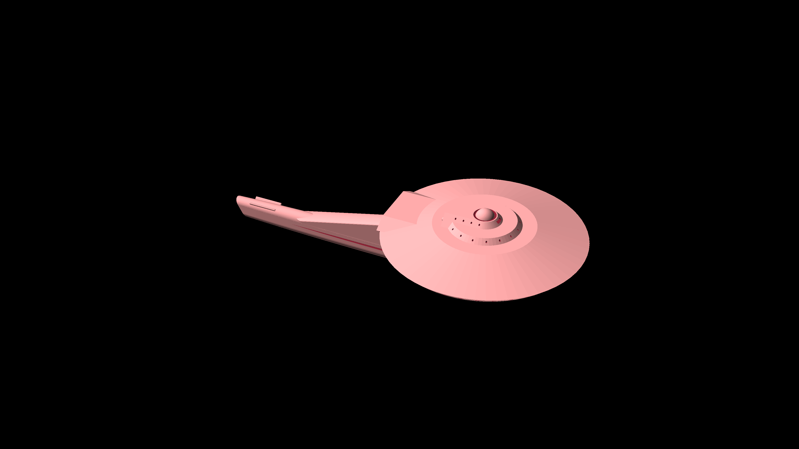

or with a class 1 secondary hull to form the more common configuration shown above.

##### Auxillary vessels

 - Type 20 small shuttles
 - Bumblebee shuttlepods

#### Atlas-B Class

Atlas-B Class heavy explorer

##### Stats

  - Length: 549m
  - Width: 240m
  - Height: 71m
  - Decks: 20
  - Crew Capacity: 1200
  - Warp Speed
    - Cruising: Warp 7
    - Peak: Warp 9.95

##### Description

The B-class is an enhancement of the A class which forms the main command section of the Atlas ship normally but separates into a heavy cruiser if needed.

The B-class is between an Excelsior and a Sovereign and is used in pretty much the same capability - as a command cruiser or as a space control vessel.

##### Structure

The B-class is built on the class 2 habitat, which enhances the class 1 habitat with additional living areas, additional weapons, and a more powerful reactor and impluse drive.

The class 2 habitat is normally used as a strategic space station, but can be combined with class 1 engines to form a light explorer

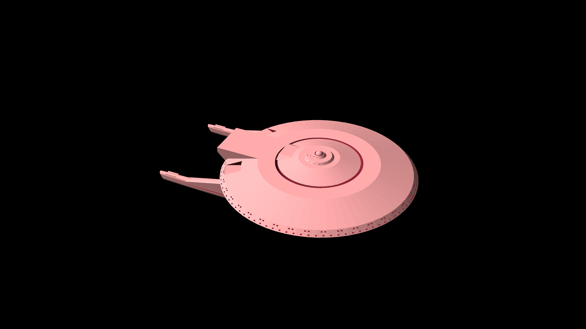

or with a class 2 engine to form a destroyer/scout

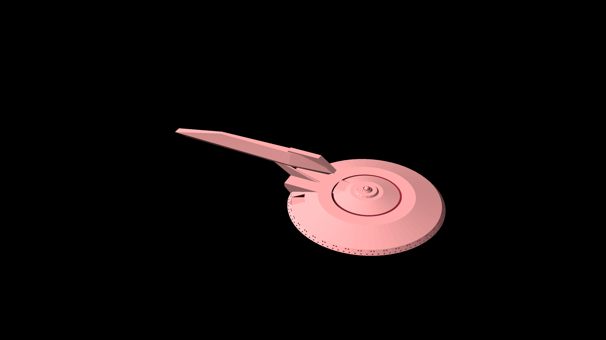

or with the class 2 secondary hull with its massive 150m hangar to form a space control vehice as show above.

##### Auxillary vessels

  - Type 20 small shuttles
  - Bumblebee shuttlepods
  - Type 23 medium shuttles
  - Type 3 large shuttles
  - Pirahna class fighters

#### Atlas-C Class

Atlas-C Class large scientific vessel

##### Stats

  - Length: 515m
  - Width: 400m
  - Height: 52m
  - Decks: 16
  - Crew Capacity: 3000
  - Warp Speed
    - Cruising: Warp 6
    - Peak: Warp 8.5

##### Description

The C Class is closest to the original pre-dominion design of the Atlas. The notable feature of having an extremely large primary hull and large hangars for intermediate class vessels are still visible on this class.

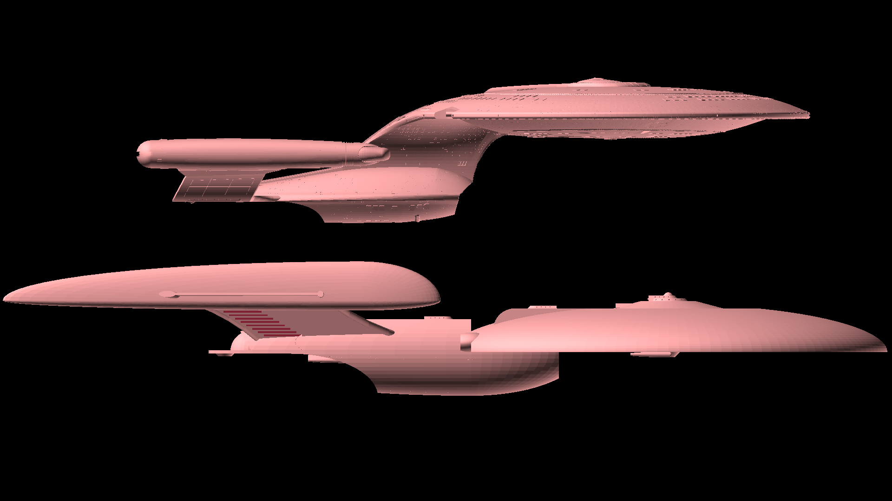

##### Structure

The main hull of the C class is a flat disk with the rear extended into a rectangular edge. The fore part of the saucer contains sensors, labs, living areas etc., while the aft section is dominated by four large hangars which can hold intermediate vessels.

A class 1 habitats forms the command section of this vessel, which can also detach to form an independent explorer ship.

The C class primary hull can be combined with class 2 warp engines to form an independent explorer combination:

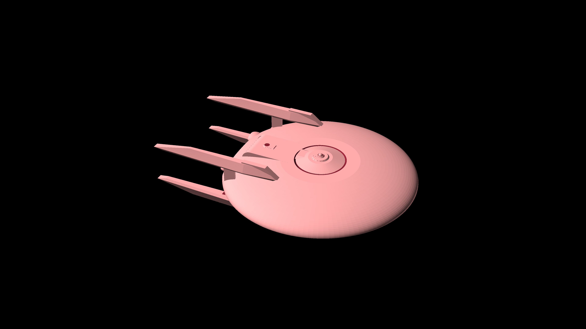

or it can be combined with 2 class 3 engine to form a super heavy cruiser

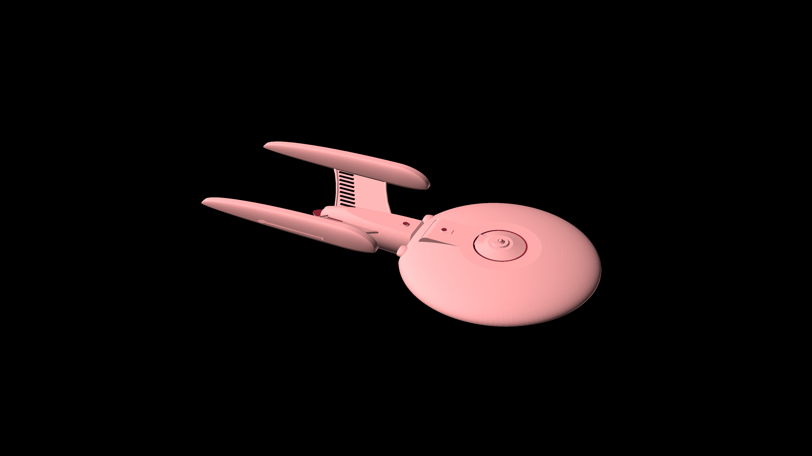

##### Auxillary vessels

- Intermediate ships
  - Orca class light corvettes
  - Raven class science vessels
  - Orbit class Yachts
- Shuttles
  - Type 20 small shuttles
  - Bumblebee shuttlepods
  - Type 23 medium shuttles
  - Type 3 large shuttles

#### Atlas D class

Atlas D class starbase

##### Stats
  - Length: 750m
  - Width: 750m
  - Height: 100m
  - Decks: 30
  - Crew Capacity: 10000
  - Warp Speed: NA

##### Description

The D Class is nothing less than a complete starbase, with administrative areas, living areas, commercial enterprises and hangars for shuttles and runabouts. It is like a self-contained city in space.

This city contains long term residence for colony members intended to extreme long term transport, as well as 
accomodation for crew of all components of the Atlas class.[^city]

[^city]: It's common for crew of all Atlas classes to have residence allocated in the C-class and 
    "commute" to their workstation, whereas the living areas on other classes are mainly used as emergency dormitories.

##### Structure

The D-Class from the outside can be differentiated into two parts; the main saucer itself, which is 750m wide and 50m tall. This is in effect
a whole city with living areas, schools, colleges, hospitals, parks, etc.

The secondary hull is a smaller cylindrical area affixed to the bottom of the main saucer. The last 3 decks of the secondary hull comprise the main
shuttlebay. 

The D-Class can also be combined with a class-4 engine to be an independant transwarp capable colony ship.

##### Auxillary vehicles

- Type 3 large shuttles
- Amazon Class runabouts
- Mako class tactical runabouts
- Ganges class heavy runabouts
- Orca-A class heavy tactical runabouts

#### Atlas-E Class

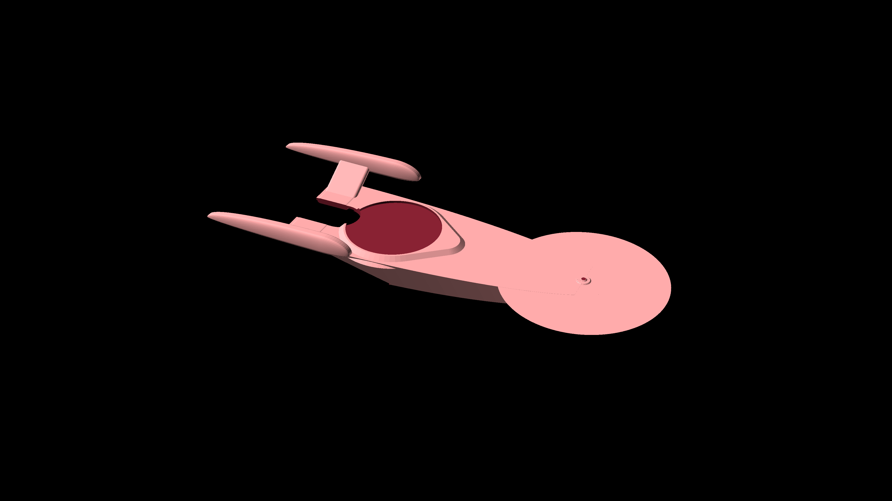

Atlas-E Class Super carrier

##### Stats

  - Length: 754m
  - Width: 480m
  - Height: 151m
  - Decks: 45
  - Crew Capacity: 250
  - Warp Speed
    - Cruising: Warp 5
    - Peak: Warp 9

##### Description

Calling the E-class a carrier would be doing it a disservice; the E-class is nothing less than a mobile shipyard capable of repairing full size starships (even something as large as an Excelsior class), and outright manufacturing small to intermediate sized ships while the E-class itself is at warp.
 

The ship contains its owm industrial replicator and is used as the main ship factory of the *Atlas* group.

##### Structure

The ship looks almost entirely secondary hull. The main hangar is big enough to hold full size ships, and the industrial replicator situated at the bottom of the ship can replicate any spare part on the fly.

The aft portion of the ship contains a 200m wide, 100m long three deck tall shuttlebay.

##### Auxillary vehicles

- Full size vehicles
  - Intrepid class cruiser
  - Constitution class cruiser
  - Excelsior class cruiser
  - Saladin/Hermes class
  - Nova class cruiser
  - Defiant class escort
  - Steamrunner class escort
  - Norway class
  - Saber class

- Intermediate ships
  - Orca class light corvettes
  - Raven class science vessels
  - Orbit class Yachts

- Shuttles
  - Mako class tactical runabouts
  - Pirahna class fighters

#### Atlas-F Class

Atlas-F Class Escort Carrier

##### Stats

  - Length: 262m
  - Width: 100m
  - Height: 25m
  - Decks: 6
  - Crew Capacity: 50
  - Warp Speed
    - Cruising: Warp 7
    - Peak: Warp 9.9

##### Description

The F class is a dedicated escort vessel for the Atlas group.

It is comparable to a *Saber* in size and function and is built with two aims in mind:
1. Fit in the space above the main hangar of the E-class
2. Not win any beauty contests

##### Structure

The F class combines a class 1 primary hull with integrated warp engines, class 2 warp nacelles and lots of armor. The class 1 hangar has been extended to hold a wing of fighter craft.

The ship is chock loaded with sensors, phaser banks and torpedoes, so the crew capacity is less than what you would expect from a class 1 habitat.

##### Auxillary vehicles

- Pirahna class fighters
- Type 20 small shuttles

#### Atlas-G class

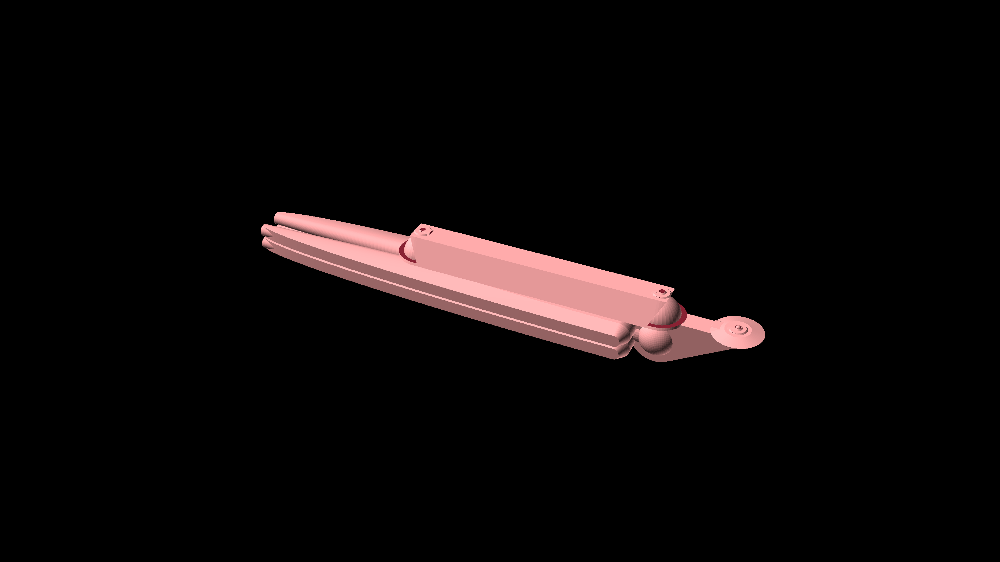

Atlas-G Class Super-heavy warp and transwarp tug

##### Stats

  - Length: 1149m
  - Width: 124m
  - Height: 110m
  - Decks: 30
  - Crew Capacity: 100
  - Warp Speed
    - Cruising: Warp 9
    - Peak: Warp 9.99
	- Transwarp: TW10

##### Description

Unlike the other ships in the Atlas assembly, the G class is not a multi-role ship. It has only one role - 
to use its extremely powerful warp and transwarp engines to pull a super-heavy class object into its warp
bubble and move it elsewhere.

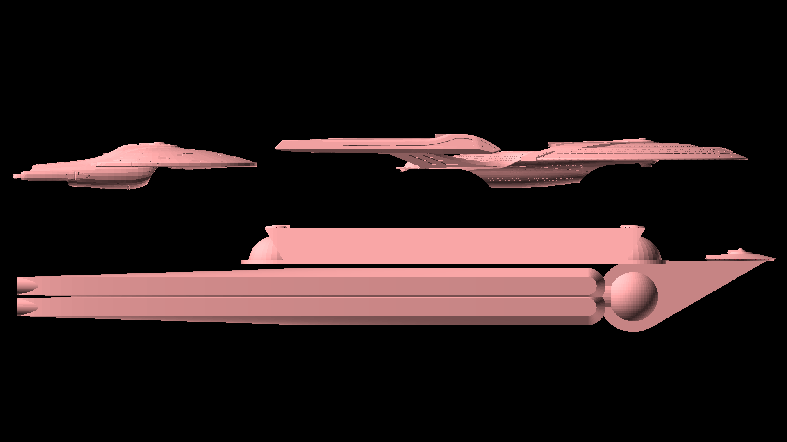

The G class can combine with up to 20 other G classes to create a warp bubble big enough to encase a full starbase
or a small to medium asteroid.

##### Structure

Despite looking like a single unconnected warp engine, the G class is a proper starship. The primary hull is merged into
the body of the secondary hull, as are the warp nacelles which line the entire ventral side of the ship. The dorsal side is
a hangar cum cargo storage bay which can hold anything from shuttles and runabouts to minor starships.

##### Auxillary vehicles

- Intermediate ships
  - Orca class light corvettes
  - Raven class science vessels
  - Orbit class Yachts

- Shuttles
  - Mako class tactical runabouts
  - Pirahna class fighters

### Intermediate auxillary vehicles

These are vehicles that are too big to be  a shuttle or a runabout, but smaller than even the small ships.

These are ships which lie in the 50m to 100m range.

These are also built based on class 0 habitat, which is used as the main bridge module on Atlas class ships. The class 0 habitat is 36m wide, has two decks, bridge and command essential areas and it's own hangar capable of holding shuttlepods or workbees.

#### Raven class

Raven class science ship.

##### Stats

  - Length: 84m
  - Width: 40m
  - Height: 16m
  - Decks: 4
  - Crew Capacity: 25
  - Warp Speed
    - Cruising: Warp 6
    - Peak: Warp 8.8

##### Description

The *Raven* class is effectively an *Oberth* class updated to 25th century technology.

For its size the *Raven* is chock full of labs. It's also built to limp back from damage that can destroy bigger 
ships, since the typical usage for this ship is to go where a full sized starship is too large to go.

##### Structure

As the *Raven* is in between a runabout and a full size starship in functionality so it is in structure - and you
can see elements of both from the shape.

The topmost deck contains a hybrid bridge cum cockpit. The subsequent decks in the 'saucer' section have the labs,
living quarters, messhall, sickbay, etc. The last deck is the engineering section which contains a standard class 0 warp engine.

##### Auxillary vehicles

- Bumblebee Shuttlepods

#### Orca class

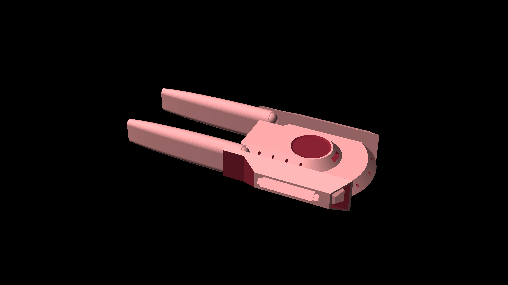

Orca class light corvette

##### Stats

  - Length: 70m
  - Width: 36m
  - Height: 10m
  - Decks: 2
  - Crew Capacity: 16
  - Warp Speed
    - Cruising: Warp 8
    - Peak: Warp 9.9

##### Description

After the Dominion war Starfleet felt the need for ships that are substantially larger than the *Peregrine* class
fighters, but still smaller than full size starships. The *Defiant* was famously effective but even that was too
big to effectively engage the Jem'Hadar attack fighters.

The Orca was conceived as an intermediate spacecraft that ewould be cheap to build and deploy in numbers, but still 
durable and deadly enough to make an impact. The design team also decided to use the Orca as a proof of concept that
the Multi-Vector paradigm scales down to smaller ships.

Another concept implemented in the Orca class was mutliple warp cores.

This makes the Orca a small and deadly ship that can punch several times its weight.

##### Structure

The Orca is a standard class 0 habitat, combined with two class 0 warp engines. The two engines can work in tandem to increase the performance and power, or as redundancies to each other. This feature is especially useful when the Orca fires its megaphaser which is powered directly by a warp core. Unlike other ships, which must restrict themselves to less than 50% of the power or take the risk of being dead in the water while the depowered warp core re-initializes, the Orca already has a backup ready to use.

Using warp cores in this way can make the warp field very unstable, which is why it's not used more commonly. The Orca uses the instability to operate on repeated microjumps as its normal operating mode. This can make the Orca highly unpredictable by an adversary during combat manoeuvres.

The drawback of the Orca is that its engines consume antimatter very fast, limiting its range. This can be offset by combining the Orca with a standard class 1 single nacelle engine:

The Orca is detachable and re-attachable with the (slower) secondary hull, which makes this a multivector ship.

##### Auxillary vehicles

The Orca class contains a single *Bumblebee* class shuttlepod.

#### Orbit class

Orbit class yacht

##### Stats

  - Length: 80m
  - Width: 36m
  - Height: 11m
  - Decks: 3
  - Crew Capacity: 15
  - Warp Speed
    - Cruising: Warp 5
    - Peak: Warp 8.2

##### Descriptions

The Orbit class was designed when it was noticed that on most ships the Captain's yacht was seldom
used for the diplomatic functions it was intended for. The ship design team went about designing 
what a yacht would require for diplomatic missions.

##### Structure

The yacht looks like a full size shape at first glance. This is a deliberate choice - it  was deciced that a starfleet first contact vessel should
look like a starfleet vessel.

The Orbit combines a class 0 habitat with a standard class 0 warp core and two class 0 type 2 engines.

The interiors of the vessel are fairly conventional except that instead of science labs the saucer 
section has large luxury accomodations. In effect this is a glorified taxi ship although it does
not lack sensors or scientific capabilities.

##### Auxillary vehicles

- Bumblebee Class shuttlepod

#### Iceland class

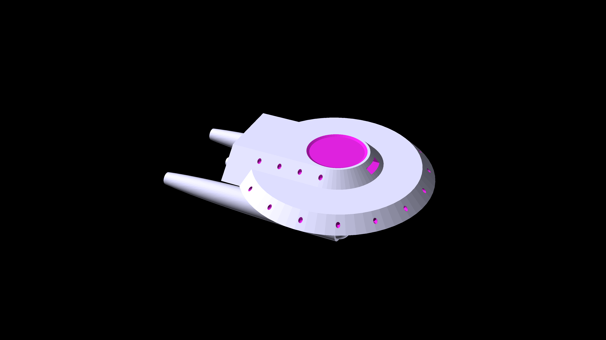

Iceland class yacht

##### Stats

  - Length: 50m
  - Width: 36m
  - Height: 12m
  - Decks: 3
  - Crew Capacity: 30
  - Warp Speed
    - Cruising: Warp 4
    - Peak: Warp 8

##### Descriptions

The Iceland class is a general purpose yacht which is bigger than a regular runabout, but smaller than a heavy
runabout, although it has a higher capacity due to its 4 decks.[^iceland]

[^iceland]: Frequently the Iceland class is used as a MEDEVAC vehicle due to its higher number of decks in such a
    small ship.
    
##### Structure

The two deck primary hull sits on top of the secondary hull with the warp nacelles extending downwards. At the aft
part is a small hangar able to contain workbees or a small shuttelpod.

The Iceland also combines a class 0 habitat with a standard class 0 warp core and two class 0 type 2 engines.

##### Auxillary vehicles

- Bumblebee Class shuttlepod

### Conventional auxillary vehicles

These are regular sized shuttles and and runabouts.

#### Bumblebee class

Bumblebee Class Shuttlepod

##### Stats

  - Length: 3m
  - Width: 2.5m
  - Height: 1.8m
  - Crew Capacity: 2
  - Warp Speed: no

##### Description

The Bumblebee is a minimal shuttlepod that is built to safely take two people from orbit
to a planet's surface, and then safely back.

The Bumblebee has another property that it is extremely small. Hence it is used as auxillary
ship in intermediate and small starships.

#### Type 20 class

Type 20 small shuttle

##### Stats

  - Length: 6m
  - Width: 3.3m
  - Height: 2.5m
  - Crew Capacity: 6
  - Warp Speed
    - Cruising: Warp 1.5
    - Peak: Warp 2.7

##### Description

The type 20 is the standard workhorse shuttle of the federation. It is not glamorous or special
but it gets the job done.

The Type 20 is found throughout starfleet on small and medium starships.

#### Type 23 Shuttle

Type 23 medium shuttle

##### Stats

  - Length: 12m
  - Width: 6.6m
  - Height: 2.5m
  - Crew Capacity: 15
  - Warp Speed
    - Cruising: Warp 2.1
    - Peak: Warp 3.5

##### Description

The Type 23 is a larger shuttle than the type 20. It has all the equipment in correspondingly larger
quantities and capabilities.

The Type 23 is also ubiquitous in medium and large starships.

#### Type 3 large shuttle

Type 3 large shuttle

##### Stats

  - Length: 18m
  - Width: 10m
  - Height: 3.2m,
  - Crew Capacity: 25
  - Warp Speed
    - Cruising: Warp 3.2
    - Peak: Warp 5.6

##### Description

At 18m long the Type 3 is more of a mini-runabout than a shuttle. 

It is frequently found in medium starships as a runabout, and in large and very large starships as shuttle.

#### Pirahna Class Fighter

Pirahna class fighter

##### Stats

  - Length: 12.3m
  - Width: 7.9m
  - Height: 2.4m
  - Crew Capacity: 2
  - Warp Speed
    - Cruising: See Note
    - Peak: Warp 9.5

##### Description

The Pirahna class is an atmospheric and exo single or double occupancy fighter meant for planetary and star system defence.

This means that although it has warp, its only used to warp at maximum speed to any part of a star system to start engaging the 
enemy. All the manouvers happen at impulse speeds after that.

#### Amazon Class Runabout

Amazon class runabout

##### Stats

  - Length: 23m
  - Width: 13m
  - Height: 5.5m
  - Crew Capacity: 16
  - Warp Speed
    - Cruising: Warp 5
    - Peak: Warp 7

##### Description

The Amazon class is nominally of the same dimensions as the *Danube* or *Yellowstone* class but because of its boxy build has twice the
capacity. 

The Amazon class is fast rising up to become the standard runabout in all classes of starship and starbase that can carry a runabout.

#### Mako Class Runabout

Mako class runabout

##### Stats

  - Length: 25m
  - Width: 13.5m
  - Height: 4.2m
  - Crew Capacity: 10
  - Warp Speed
    - Cruising: Warp 6.5
    - Peak: Warp 9.2

##### Description

The Mako class is a tactical runabout tweaked for maximum speed and striking power.

The Mako class forms the primary line of defence for the Atlas group.

#### Ganges Class Heavy Runabout

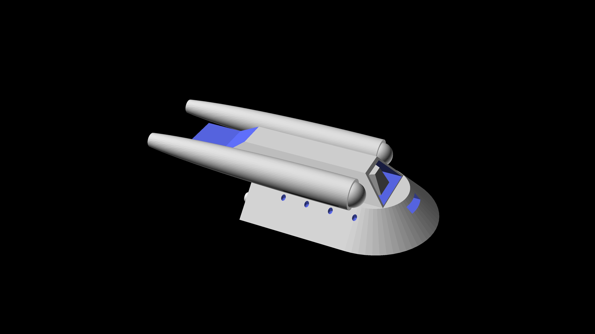

Ganges class heavy runabout

##### Stats

  - Length: 48m22m
  - Width: 24m
  - Height: 9m
  - Decks: 3
  - Crew Capacity: 32
  - Warp Speed
    - Cruising: Warp 6.8
    - Peak: Warp 9.5

##### Description

The Ganges class straddles the line between a small and intermediate ship and falls into the small ship category
by about 1m. But with two decks and even a sizable shuttlebay the Ganges can easily be a small starship rather
than an auxillary vehicle.

The Ganges combines what is know as a class 0.5 habitat with a standard class 0 warp core and class 0 type 2 engines.

##### Auxillary vehicles

- Bumblebee class shuttlepod
- misc land vehicles
